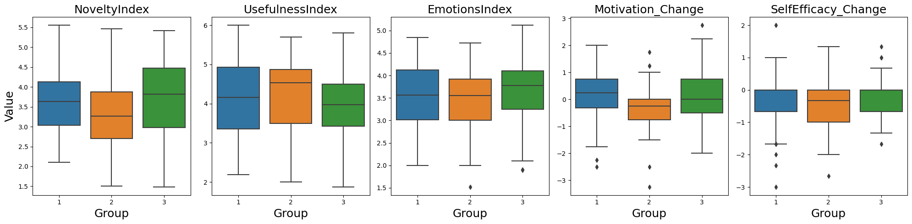

# Study Results: AI in Creativity Development

Philpp Rosenkranz, University of Cologne (prosenkr@smail.uni-koeln.de)

*Are you just here to see how your story was rated? Go ahead and jump to the <a href="#stories-and-scores">stories and their scores</a>.*

Since you have reached this page, you have probably participated in the survey for my master's thesis. Once again, thank you very much for your contribution! Following, the results of my studies are shortly summarized and the submitted stories are listed, including their scores. \\
Overall, 196 valid short stories were gathered. Besides submitting an 8-sentence short story, each participant took part in a divergent thinking task (DAT score), and completed pre- and post-questionnaires regarding their creative self-efficacy and motivation to enhance their creative writing skills. In a secondary survey, each story was rated by randomly assigned evaluators. This way, approximately five ratings per story were gathered, of which the averages were taken. The stories were rated by the following evaluation criteria on a scale from 1 (Not at all) to 7 (Extremely):

### Evaluation Criteria

<table>
  <thead>
    <tr>
      <th>Category</th>
      <th>Question</th>
      <th>Variable</th>
    </tr>
  </thead>
  <tbody>
    <tr>
      <td rowspan="7"><strong>Creativity Score</strong></td>
      <td><strong>Novelty Index:</strong></td>
      <td></td>
    </tr>
    <tr>
      <td>How novel do you think the story is?</td>
      <td><em>Novel</em></td>
    </tr>
    <tr>
      <td>How original do you think the story is?</td>
      <td><em>Original</em></td>
    </tr>
    <tr>
      <td>How rare (i.e., unusual) do you think the story is?</td>
      <td><em>Rare</em></td>
    </tr>
    <tr>
      <td><strong>Usefulness Index:</strong></td>
      <td></td>
    </tr>
    <tr>
      <td>How feasible do you think the story is to be developed into a complete book?</td>
      <td><em>Feasible</em></td>
    </tr>
    <tr>
      <td>How appropriate do you think the story is for the intended audience?</td>
      <td><em>Appropriate</em></td>
    </tr>
    <tr>
      <td rowspan="5"><strong>Emotional Characteristics</strong></td>
      <td>The story is funny</td>
      <td><em>Funny</em></td>
    </tr>
    <tr>
      <td>The story is boring</td>
      <td><em>Boring</em></td>
    </tr>
    <tr>
      <td>The story is well written</td>
      <td><em>WellWritten</em></td>
    </tr>
    <tr>
      <td>I enjoyed reading this story</td>
      <td><em>Enjoyed</em></td>
    </tr>
    <tr>
      <td>The story has a surprising twist</td>
      <td><em>Twist</em></td>
    </tr>
    <tr>
      <td rowspan="2"><strong>Ownership Index</strong></td>
      <td>To what extent do you think the story reflects the author's own ideas?</td>
      <td><em>AuthorsIdea</em></td>
    </tr>
    <tr>
      <td>To what extent do you think the story was based on or written by an AI tool?</td>
      <td><em>ByAI</em></td>
    </tr>
  </tbody>
</table>

## Short Overview of Results

Participants were assigned to one of three experimental groups with different treatments regarding the task of writing a short story. **Group 1** had no access to ChatGPT, **Group 2** had access to ChatGPT while writing the short story, and **Group 3** had access to ChatGPT after the task to revise their story. Significant differences with regard to the study objective were primarily found comparing Group 1 and Group 2. Analyzing the cosine similarity of each story to other stories within their group reveals significantly higher average similarity when participants had unrestricted access to ChatGPT (see Figure 1). This suggests that collective novelty diminishes with the introduction of AI compared to creative writing without AI, as ChatGPT produces content that reflects patterns learned from existing data.

<figure>

<figcaption>Figure 1: Cosine Similarity to Other Stories Within Group</figcaption>
</figure>

This finding was also supported by a significantly lower novelty index of stories in Group 2 rated by other participants (see Figure 2). No significant differences between groups were found for the usefulness rating and for emotional characteristics like *funny* or *well written*.

<figure>
  
  <figcaption>Figure 2: Box Plots Outcome Variables across Groups</figcaption>
</figure>

The pre- and post-questionnaires revealed a significantly lower motivation to enhance creative writing skills after the task if a participant had unrestricted access to ChatGPT (see Figure 3). This highlights a potential negative consequence of AI support on creative skill development. When AI takes on a primary role in content creation, it may diminish the individual’s sense of authorship and control over the creative process, undermining autonomy and, consequently, intrinsic motivation. In addition, extrinsic motivation seems to be weakened by the perception that the goal achieved is not related to one’s own accomplishments, but rather to the supported AI. The fact that this decline in motivation was recognized despite the short duration of the experiment is particularly remarkable and indicates that the effects of AI support on motivation can appear even in short term scenarios. Creative self-efficacy on the other hand showed no significant differences among the groups.

<figure>

</figure>

<figure>

<figcaption>Figure 3: Bootstrap Distribution of Group Coefficients on Outcome Variables</figcaption>
</figure>

This study further aimed to investigate differences with regards to the baseline creativity skill levels by measuring divergent thinking skills with a divergent association task (DAT). Previous studies observed an equalizing effect of AI, with low-skilled participants benefiting greater from AI regarding their writing quality. In this study no such effects were observed. This may be due to the relatively high average skill level of all participants or the fully unrestricted access of ChatGPT compared to other studies.

## Summary Statistics Story Ratings

Summary statistics of short story ratings and DAT scores of all participants (196).

|                 |   mean |   min |   max |   std |
|:----------------|-------:|------:|------:|------:|
| CreativityScore |   3.81 |  1.73 |  5.10 |  0.70 |
| UsefulnessIndex |   4.09 |  1.88 |  6.00 |  0.94 |
| NoveltyIndex    |   3.52 |  1.48 |  5.56 |  0.90 |
| OwnershipIndex  |   3.62 |  1.31 |  5.25 |  0.66 |
| Enjoyed         |   4.03 |  1.40 |  5.83 |  0.97 |
| WellWritten     |   4.06 |  1.17 |  6.50 |  1.05 |
| Boring          |   3.42 |  1.40 |  6.33 |  0.92 |
| Funny           |   2.44 |  1.00 |  5.75 |  1.03 |
| Twist           |   3.60 |  1.12 |  6.38 |  1.16 |
| DAT Scores      |  81.13 | 53.68 | 93.18 |  6.89 |

## Stories and Scores
To find your story, you may want to filter by date (reminder in mail) and expand the story text. This table displays only stories of participants that did *not* request to exclude their story. If your story is not included and you wish to receive your scores, please contact me. \\
You were part of one of 3 experimental groups: \\
**Group 1**: No access to ChatGPT, **Group 2**: Access to ChatGPT while writing the short story, **Group 3**: Access to ChatGPT after the task to revise their story. \\
Rating scales from 1 (Not at all) to 7 (Extremely). To get a perspective on your scores, see the summary statistics above. For more details on the DAT scores (task where you had to name 10 words as different as possible) see <a href="https://www.datcreativity.com/about" target="_blank">here</a>.

<table border="1" class="dataframe" id="storyTable">
<thead>
<tr style="text-align: right;">
<th>Story <button onclick="sortTable(0)">⇅</button></th>
<th>Date <button onclick="sortTable(1)">⇅</button></th>
<th>Group <button onclick="sortTable(2)">⇅</button></th>
<th>Creativity Score <button onclick="sortTable(3)">⇅</button></th>
<th>Usefulness Index <button onclick="sortTable(4)">⇅</button></th>
<th>Novelty Index <button onclick="sortTable(5)">⇅</button></th>
<th>Ownership Index <button onclick="sortTable(6)">⇅</button></th>
<th>Enjoyed <button onclick="sortTable(7)">⇅</button></th>
<th>Well Written <button onclick="sortTable(8)">⇅</button></th>
<th>Boring <button onclick="sortTable(9)">⇅</button></th>
<th>Funny <button onclick="sortTable(10)">⇅</button></th>
<th>Twist <button onclick="sortTable(11)">⇅</button></th>
<th>DAT Score <button onclick="sortTable(12)">⇅</button></th>
</tr>
</thead>
<tbody>
<tr>
<td>

Am 5.7.2024 machen sich die Freunde Fabi und Philipp...
 auf eine abenteuerliche Reise zum Mittelpunkt der Erde, einen Ausflug der ihr beider Leben verändern soll. In ihrer Vorbereitung besinnen sich die beiden auf einen Schwur, der Schlüssel zum Erfolg dieses Abenteuers werden soll. Ihr Schwur umfasst folgende Punkte: wir werden jedes ß als normales s aussprechen; wir werden nicht rasten, bis wir gemeinsam angekommen sind, wir werden das Ankommen ausgiebig feiern und wir werden auch die kleinen Erfolge hochleben, denn der Weg ist das Ziel. Mit der Einigung auf diese Punkte stolzieren die beiden los und steigen in den Flieger, um zum Mittelpunkt der Erde zu fliegen. Die Kontrollen im Flieger sind glücklicherweise nicht zu voll und die Ryanair Maschine hebt pünktlich ab. Das Problem allerdings: die beiden dürfen nicht rasten. Ihre Lösung ist, dass der charmante Philipp die Stewardess überzeugen kann, den Service mit Fabi zu übernehmen und sie können den gesamten Flug in Bewegung bleiben. Angekommen am Mittelpunkt der Erde gehen die beiden auf das größte Festival der Welt und feiern ihren grandiosen Erfolg: Die beiden schauen sich tief in die Augen und sagen "solche Abenteuer sind die Schokoladen-Sose (Soße) des Leben, die es süs (süß) und lebenswert machen".
</td>
<td>2024-07-05</td>
<td>3</td>
<td>3.81</td>
<td>2.62</td>
<td>5.00</td>
<td>3.50</td>
<td>4.25</td>
<td>3.25</td>
<td>4.50</td>
<td>4.00</td>
<td>4.25</td>
<td>82.79</td>
</tr>
<tr>
<td>

In der frostigen Arktis lebte die 19-jährige Abenteurerin Lara,...
 die von der Legende eines magischen Eises gehört hatte, das unendliche Kräfte verleihen sollte. Entschlossen machte sie sich auf den Weg, begleitet von ihrem mutigen Husky-Partner Frost, um das geheimnisvolle Eis zu finden. Auf ihrer Reise durch eisige Stürme und gefrorene Landschaften begegneten sie einem freundlichen Robbenclan, der ihnen den Weg wies. Schließlich erreichten sie eine versteckte Höhle, in der das magische Eis verborgen lag. Doch plötzlich tauchte ein furchteinflößender Schneewächter auf, der das Eis beschützte. Mit List und Tapferkeit gelang es Lara, den Schneewächter zu überlisten und das magische Eis zu bergen. Als sie das Eis berührte, spürte sie eine Welle unglaublicher Energie, die sie und Frost in ein helles Licht hüllte. Gemeinsam kehrten sie als Helden zurück, bereit, die Arktis und die Welt mit ihren neuen Kräften zu schützen und zu erforschen.
</td>
<td>2024-07-05</td>
<td>2</td>
<td>4.61</td>
<td>4.69</td>
<td>4.54</td>
<td>3.44</td>
<td>4.50</td>
<td>5.00</td>
<td>3.00</td>
<td>2.50</td>
<td>3.62</td>
<td>82.24</td>
</tr>
<tr>
<td>

Karin, Peter und Georg waren seit der Schulzeit befreundet...
 und beschlossen nach ihrem Schulabschluss eine ganz besondere Abschlussfahrt zu machen: Eine Hüttentour in den Alpen. Am Abend vor der ersten Etappe waren alle drei ganz schön aufgeregt, schließlich stand am nächsten Tag die Besteigung des Großvenedigers bevor. Um 4 Uhr morgens ging es los, der Bergführer begrüßte alle drei und wirkte nervös - die vergangene Woche war zeimlich warm gewesen, sodass das Eis des Gletschers geschmolzen und die Gefahr von Gletscherspalten sehr groß war. Die Gruppe bildete eine Seilschaft und beeilte sich, um noch vor dem Sonnenaufgang auf dem Gletscher zu sein. Direkt zu Beginn viel auf, dass der Schnee matschig und das Eis brüchig war. Peter kam ins straucheln, der Bergführer rief "Achtung Spalte!" - Doch da war es schon zu spät, Peter hing mit einem Bein bis zur Hüfte in der Tiefe des Gletschers. Karin reagierte ganz schnell, sie machte einen Satz nach vorn, das Seil straffte sich und Peter konnte sich mit dem freien Bein aus dem Abgrund hochstützen. Erleichterung kam auf und die Truppe setzte ihren Weg zum Gipfel fort.
</td>
<td>2024-07-05</td>
<td>1</td>
<td>4.17</td>
<td>5.25</td>
<td>3.08</td>
<td>3.12</td>
<td>5.50</td>
<td>5.00</td>
<td>2.88</td>
<td>1.25</td>
<td>2.75</td>
<td>80.58</td>
</tr>
<tr>
<td>

Anna wollte sich im Urlaub in Brasilien einen großen...
 Wunsch erfüllen, nämlich einen Trip durch den Regenwald. Es war ein schwülwarmer Tag, das Wasser tropfte von den Bäumen und der Pfad durch den Dschungel war fast vollkommen zugewachsen. Zusammen mit ihrem Freund Marco machte sie sich auf den Weg. Die Luft war erfüllt vom ohrenbetäubenden Pfeifen, Zwitschern und Gebrüll der Urwaldbewohner. So merkte sie nicht, dass sich ihr Freund immer weiter entfernt hatte. Erst als sie im Nacken einen warmen Luftzug spürte, drehte sie sich um - und sah einen großen Affen. Erstarrt blieb sie stehen und unterdrückte einen Schrei. Wie groß war die Erleichterung, dass das Wesen mit beiden Händen seine Maske abnahm und sich darunter Marco verbarg!
</td>
<td>2024-07-05</td>
<td>1</td>
<td>4.67</td>
<td>5.25</td>
<td>4.08</td>
<td>3.31</td>
<td>4.88</td>
<td>4.88</td>
<td>2.62</td>
<td>2.88</td>
<td>5.62</td>
<td>83.12</td>
</tr>
<tr>
<td>

Es ist Samstag, ich weiß, viele in meinem Alter...
 würden bestimmt in die Disko gehen, Alkohol trinken und Männer anquatschen, aber so bin ich nicht. Ich gehe heute wandern, alleine, das ist das erste Mal, dass ich alleine wandern gehe. Ob ich ein bisschen nervös bin? - vielleicht. Ich hab mich so um 10:00 Uhr auf den Weg gemacht- schon ziemlich früh, oder was meinst du? Naja, ich bin dann losgegangen und habe auf dem Weg zu den Bergen mein LSD eingeschmissen. Als ich da war fingen die optischen Verzerrungen an, die Berge waren bunt und alles bewegte sich, die Bäume lächelten mich an und luden mich ein näher zu kommen. Nach einer drei ständigen Wanderung bin ich dann da angekommen wo ich ankommen wollte...
</td>
<td>2024-07-06</td>
<td>3</td>
<td>3.32</td>
<td>2.90</td>
<td>3.73</td>
<td>4.30</td>
<td>3.20</td>
<td>2.80</td>
<td>4.80</td>
<td>3.60</td>
<td>4.20</td>
<td>78.54</td>
</tr>
<tr>
<td>

In einem kleinen Küstendorf lebte ein mutiger Taucher namens...
 Finn, der schon immer von einer Unterwasser-Expedition träumte. Eines Tages erfuhr er von einem geheimnisvollen Wrack, das angeblich unermesslichen Reichtum enthielt. Ohne zu zögern, machte er sich auf den Weg zur Expedition. Gemeinsam mit einem erfahrenen Team tauchte Finn in die Tiefen des Ozeans ab. Doch plötzlich gerieten sie in einen heftigen Sturm und verloren die Orientierung. Als sie schließlich das Wrack erreichten, entdeckten sie nicht nur wertvolle Schätze, sondern auch eine geheimnisvolle Karte, die sie zu einem noch größeren Abenteuer führte. Zurück an der Oberfläche bereiteten Finn und seine Crew sich auf eine Reise vor, um den Schatz auf der Karte zu finden. Mit viel Proviant und Hoffnung im Herzen brachen sie schließlich auf in die Ferne.
</td>
<td>2024-07-06</td>
<td>2</td>
<td>3.11</td>
<td>4.50</td>
<td>1.72</td>
<td>3.08</td>
<td>3.83</td>
<td>5.33</td>
<td>4.50</td>
<td>2.00</td>
<td>3.17</td>
<td>78.98</td>
</tr>
<tr>
<td>

Ein hektischer Tölpel stoplert ans Bezahlterminal der Mensakantine und...
 klickt vergebens auf den schillernden Bildschirm ein. Manuel murmelt, dass es doch heute seine Leibspeise, die vegane Hackrolle, geben müsse, welche er routiniert jeden Freitag Nachmittag zu sich nehme. Diese vegane Hackrolle erfüllt seine grundlegensten Bedürfnisse: Liebe, Aufmerksamkeit und Familie. Manuel zittert vor Angst einer kurzfristigen Menüänderung, läuft furchterfüllt auf das kafffeezubereitende Personal zu erkundigt sich und erhält einen verbitterten Kommentar, heute sei Mittwoch und erst in 2 Tagen könne er die Verkörperung von Genuss und Intimität vergenussferkeln. Manuels Gedanken schweifen ab, gestern, am Donnerstag, habe er doch den Sieg der spanischen Nationalmannschaft gegen Italien bei der Europameisterschaft 2024 gesehen. Manuel schnappt sich sein mobiles Endgerät und sucht nach dem Endergebnis des Spiels, jedoch findet das Spiel erst am folgenden Tag statt. Vor Verärgerung und Wut sprintet er in Richtung seines WG-Zimmers los und stellt fest, dass er im Schlaf seine Zeitreisemaschine von Metro betätigt haben muss und 2 Tage in die Vergangenheit gereist ist. Er wirft sich auf sein Bett, stellt die Zeitmaschine auf 2 Tage in die Zukunft ein, schließt die Augen und erwacht mit einem Lächeln - '1:0 für Spanien' leuchtet auf seinem Handydisplay, während er vor Freude auf seine geliebte vegane Hackrolle zusteuert.
</td>
<td>2024-07-08</td>
<td>3</td>
<td>3.88</td>
<td>3.00</td>
<td>4.75</td>
<td>3.12</td>
<td>3.50</td>
<td>4.50</td>
<td>3.25</td>
<td>4.50</td>
<td>4.75</td>
<td>82.90</td>
</tr>
<tr>
<td>

Die Welt wurde von einem Asteoriden größer als der...
 Eiffelturm getroffen und zog ein Massensterben nach sich. Die Erdoberfläche wurde überschwemmt, Kontinentalplatten drifteten auseinander und formten neue Festlandformationen. Das Leben wie wir es kennen wurde auf den Kopf gestellt und nichts ist mehr so wie es war. Die Oberhäupter der 13 letzten überbliebenden Stämme der Menschheit kamen zu dem Entschluss, dass es nötig sei, eine Expedition zum ursprünglichen Cape Canaveral in Florida zu planen, welches nun 2 Kilometer unter der Meeresoberfläche liegt, um dort alte Baupläne für eine Raumfähre zu sichern, die den Überlebenden dabei helfen soll, einen neuen Heimatplaneten zu finden. Ein Team der mutigsten Taucher machte sich auf den Weg und entdeckte unzählige neue Tiearten und Lebewesen. Nachdem das Team 190 Tage unterwegs ware, fingen sie an, Schwimmhäute zwischen den Fingern zu entwickeln. Sauerstoff Flaschen waren nach weiteren 80 Tagen auch nicht mehr nötig, denn sie bildeten eine Art Kiemenorgan am Hals aus, wodurch sie ununterbrochen unter Wasser bleiben konnten. Mit der Zeit vergaßen die Taucher ihr eigentliches Ziel und erfreuten sich an ihrem neuen, unendlich weit erscheinenden Lebensraum und bildeten eine neue Zivilisation.
</td>
<td>2024-07-08</td>
<td>3</td>
<td>4.95</td>
<td>5.30</td>
<td>4.60</td>
<td>4.00</td>
<td>4.60</td>
<td>4.60</td>
<td>2.40</td>
<td>2.40</td>
<td>4.80</td>
<td>86.53</td>
</tr>
<tr>
<td>

Unsere Geschichte beginnt auf guten 2.500 Metern in den...
 österreichischen Alpen. Jürgen und Jörg waren seit knapp 4 Stunden unterwegs als plötzlich durch Jörg's Tritt eine Steinlawine ausgelöst wurde. "ACHTUNG!", rief Jörg zum erschrocken Jürgen der unter ihm lief. Jürgen konnte gerade noch rechtzeitig dem annahenden Geröll ausweichen aber der einzige Rückweg war nun versperrt. Die Dämmerung setzte bereits ein als sich die beiden Freunde ihrer schwierigen Situation bewusst wurden. Jörg, der immer einen kühlen Kopf bewahrt, wusst sofort was zu tun ist. Da sich Jürgen beim Ausweichen auch leicht den Knöchel verknackste, rufen sie sofort die Rettungskräfte an. Nur 30 Minuten später hörten die beiden den Helikopter anfliegen und eine weitere Stunde später waren sie bereits in ihrer Unterkunft.
</td>
<td>2024-07-08</td>
<td>1</td>
<td>2.75</td>
<td>2.88</td>
<td>2.62</td>
<td>3.25</td>
<td>4.25</td>
<td>4.50</td>
<td>4.38</td>
<td>2.88</td>
<td>3.00</td>
<td>74.47</td>
</tr>
<tr>
<td>

Lisa saß ratlos vor dem Thema ihrer Hausarbeit mit...
 dem Titel "Was versteht man unter einem Dschungel?". Zunächst dachte sie an einen dicht bewachsenen, tropischen Wald, der vor verschiedenen Pflanzenarten und Tieren nur so strotzte. Seien es Affen, bunte Vögel, Frösche oder Schmetterlinge, Lisa konnte diese Vielfalt regelrecht vor ihrem inneren Auge sehen. Ein Versteckspiel mit einem Tiger, giftige Pflanzen oder das häufig extreme Wetter - was für Abenteuer man dort wohl erleben konnte! Andererseits hatte Sie in der Zeitung letzte Woche einen anderen Begriff gelesen: der Großstadt-Dschungel, eher grau und durch Beton bedeckt. Mit zahlreichen Autos, die an einem vorbeisausten und großen Menschenmassen, sodass es schon an ein Abenteuer grenzte, pünktlich den Bus zu kriegen! Ein Begriff für so zwei unterschiedliche Dinge - und doch schien es ob die Existenz des einen Dschungels, den anderen bedroht. "Das ist es!", dachte Lisa und setzte sich aufrechter hin, "darüber möchte ich schreiben!"
</td>
<td>2024-07-08</td>
<td>2</td>
<td>3.23</td>
<td>3.25</td>
<td>3.21</td>
<td>2.88</td>
<td>3.75</td>
<td>4.88</td>
<td>3.38</td>
<td>1.75</td>
<td>2.38</td>
<td>85.80</td>
</tr>
<tr>
<td>

Mit dem Privatflugzeug im Sturzflug auf die Erde zu...
 rasen, dachten die Insassen bereits, dass ihr Ende gekommen sei. Doch plötzlich, anstatt zu zerschellen, durchbrach das Flugzeug den Boden und flog weiter in eine scheinbar hohle Welt hinein. Die Welt ist hohl, und sie ist wie ein eigenes Sonnensystem mit dem leuchtenden Erdkern als Sonne und zahlreichen Planeten mit unterschiedlichster Flora und Fauna, die um den Kern kreisen. Sie bruchlanden auf einem Planeten und erleben dort faszinierende Abenteuer mit Dinosauriern und entdeckten sogar ein neues Flugzeug, mit dem sie sich nun durch diesen neuen Kosmos bewegen können. Mutig und neugierig erkundeten sie weitere fantastische Planeten voller Geheimnisse und unerforschter Wunder, bis sie auf einem Flug plötzlich von etwas getroffen werden. Es stellt sich heraus, dass zwei Planeten im Krieg sind, und die Crew gerät mitten in diesen Konflikt um Ressourcen, die es für eine begrenzte Anzahl an Lebewesen ermöglichen sollen, den eigenen Planeten zu verlassen, um vor der bevorstehenden Ausbreitung des Erdkerns zu flüchten. Die Crew schlichtet diesen Konflikt und zusammen mit einigen Forschern fliegen sie zum letzten Planeten, der am nächsten am Erdkern liegt, bei dem es sich herausstellt, dass dieser eigentlich nur ein großes rundes Labor ist, mit dem man alle möglichen Eigenschaften des Kosmos steuern kann. Sie können so die Ausbreitung verhindern, sind aber verwirrter als jemals zuvor, vor allem als ein Crewmitglied eine Wandbemalung findet, auf der die hohle Erde zu sehen ist, wie sie selbst nur ein Teil einer noch größeren hohlen Erde ist.
</td>
<td>2024-07-08</td>
<td>2</td>
<td>4.79</td>
<td>4.88</td>
<td>4.71</td>
<td>2.81</td>
<td>3.25</td>
<td>3.12</td>
<td>3.25</td>
<td>1.75</td>
<td>4.88</td>
<td>85.14</td>
</tr>
<tr>
<td>

Es ging einmal ein Donaudampfschifffahrtskapitaen auf Bergsteigerabenteuerreise. Dort traf...
 er einen Steuerrechtsfachanwalt und stritt sich mit ihm ueber Steuerbordfachbegriffe. Dann ging er weiter und traf vier Mittvierzigerstudentinnen. Mit diesen spielte er 4D Schach und gewann keine einzige Partie. Er lief weiter Richtung Gipfelkreuzzielkoordinate, als ein Stueck Fels abbrach. Der Donaudampffschiffahrtskapitaen fiel und fiel, und fluchte auf die Gravitationskraft. Da verschwand die Gravitationskraft, zusammen mit Zeit, weil sie beleidigt waren. Der Donaudampffschiffahrtskapitaen nahm seine VR-Brille ab und wunderte sich ueber die verrueckte Welt, die die generative KI fuer ihn kreiert hatte, auf seiner Bergsteigerabendteuerreise.
</td>
<td>2024-07-08</td>
<td>1</td>
<td>3.57</td>
<td>2.56</td>
<td>4.58</td>
<td>3.62</td>
<td>2.12</td>
<td>2.25</td>
<td>4.50</td>
<td>2.50</td>
<td>4.12</td>
<td>92.61</td>
</tr>
<tr>
<td>

Ich bin zur Zeit in der Gegenwart. Aber jetzt...
 reise ich in die Vergangenheit. Dort möchte ich verhindern, den Verfasser dieser Studie kennenzulernen. Dann würde ich mich nicht verpflichtet fühlen seine Studie zu absolvieren. Denn ganze 8 Sätze zu schreiben finde ich wirklich viel. Also, los geht die Reise. Ba Bi Bub Bip Bip. Es ist der Tag, an dem wir uns kennengelernt haben - ich bleibe im Bett.
</td>
<td>2024-07-08</td>
<td>3</td>
<td>3.60</td>
<td>2.62</td>
<td>4.58</td>
<td>5.25</td>
<td>4.25</td>
<td>4.00</td>
<td>2.75</td>
<td>4.50</td>
<td>3.00</td>
<td>80.77</td>
</tr>
<tr>
<td>

Ich bin jetzt schon seit 8 Tagen keinem Menschen...
 mehr begegnet. Meine Gedanken werden still, die Geräusche um mich herum, machen mir keine Angst mehr, ich bin ein Teil des Dschungels geworden. Ein Bewohner wie die anderen. Es gibt Nahrung im Überfluss, die Bäume bilden ein kühles Dach, ich schlafe auf Bäumen, deren Äste so breit sind wie mein Bett es war. Ich denke nicht mehr oft an mein altes Leben zurück. Es ist in unendliche Ferne gerückt mit allem, was mir dort so wichtig erschien. Selsbst sie: In den ersten drei Nächten hat ihr Gesicht mich noch durch meine Träume begleitet. Jetzt scheint es mir schon, als hätte ich sie nie gekannt – ich lebe im Wald, wie seine anderen Bewohner, ein Tag gleicht dem anderen und es gibt keine Zeit; nur warmes, weiches Grün.
</td>
<td>2024-07-09</td>
<td>1</td>
<td>4.30</td>
<td>4.80</td>
<td>3.80</td>
<td>4.10</td>
<td>4.40</td>
<td>4.80</td>
<td>3.00</td>
<td>1.60</td>
<td>1.60</td>
<td>89.68</td>
</tr>
<tr>
<td>

Es war an einem sonnigen Samstagmorgen, als Finn und...
 Mia beschlossen, den höchsten Berg der Region zu besteigen. Der Aufstieg war übel anstrengend und sie struggleten mit der immer dünner werdenden Bergluft. Als sie endlich den Gipfel erreichten, waren sie überwältigt von der atemberaubenden Aussicht. "Digga, wir haben es geschafft! Wir sind die wahren Ehrenmänner!", rief Finn begeistert. Mia grinste und antwortete: "Lowkey krass, wir haben es echt gerockt." Mit breitem Pferdekuchengrinsen steppten die beiden wieder den Berg herab, während laut "all i do is win" von DJ Khaled über ihre Boxen lief. Abends waren ihre Körper anders erschöpft und sie schliefen wie ein Stein.
</td>
<td>2024-07-09</td>
<td>2</td>
<td>4.18</td>
<td>3.50</td>
<td>4.87</td>
<td>3.30</td>
<td>4.40</td>
<td>3.00</td>
<td>4.20</td>
<td>4.40</td>
<td>2.20</td>
<td>80.98</td>
</tr>
<tr>
<td>

Alle Vögel fliegen auf einmal gemeinsam aus den Bäumen...
 und auch andere Tiere ergreifen die Flucht hinter uns und auch Henri, unser Hund, gallopiert zurück zum Auto. Wir schauen in die Ferne und sehen, wie nach und nach alles wie gemalt aussieht und bemerken, dass eine Gruppe anders aussehender Personen durch die Gegend streichen. Langsam realisieren wir, dass wir vielleicht keine Bekanntschaft mit diesen Personen machen wollen, da wir nicht auch noch wie gemalt aussehen wollen. Wir beschließen, so schnell wie möglich uns auf der Umgebung zu entfernen. Im Auto angekommen, schalten wir das Radio ein (ja so oldschool sind wir noch) und hören auf so gut wie jedem Kanal, dass man sich so schnell wie möglich nach Hause begeben soll und nicht das Haus verlassen sollte. Plötzlich bemerken wir, dass auch unser Auto wie gemalt aussieht und wir uns in einer Art gemalten Welt befinden. Panisch versuchen wir zu entkommen, doch die Straßen führen uns immer wieder zurück zum Ausgangspunkt. Verzweifelt suchen wir nach einer Lösung, als plötzlich der Hund anfängt zu sprechen und uns einen Hinweis gibt wie wir entkommen können.
</td>
<td>2024-07-09</td>
<td>3</td>
<td>4.48</td>
<td>4.38</td>
<td>4.58</td>
<td>3.88</td>
<td>4.00</td>
<td>3.50</td>
<td>3.25</td>
<td>4.75</td>
<td>4.25</td>
<td>78.02</td>
</tr>
<tr>
<td>

Katrin belegte während ihres Mexikourlaubs einen Tauchkurs. Der Tauchlehrer...
 holte sie am Hafen ab und zusammen fuhren sie mit Equipment auf dem Boot an eine seichte Wasserstelle. Nach kurzer Anleitung und Übungen unter Wasser begannen sie ihre Unterwasser-Expedition. Bald waren sie auf sieben Meter Tiefe angekommen und Katrin konnte bunte Fische und Korallen durch ihre Taucherbrille betrachten. Auf dem Meeresboden entdeckte sie einen glänzenden Gegenstand. Neugierig hob sie ihn auf und stellte fest, dass es sich um ein altes Medallion handelte. Vorsichtig öffnete sie es, indem sie auf einen Knopf an der Seite drückte. Doch anstelle eines Fotos oder einer Inschrift fand sie einen kleinen Krebs vor, der sich die Kette als neues Zuhause zu Eigen gemacht hatte.
</td>
<td>2024-07-09</td>
<td>1</td>
<td>4.35</td>
<td>4.70</td>
<td>4.00</td>
<td>4.40</td>
<td>5.40</td>
<td>5.20</td>
<td>3.00</td>
<td>2.80</td>
<td>3.80</td>
<td>81.86</td>
</tr>
<tr>
<td>

Tobias und Karina haben gemeinsam Meeresbiologie studiert und möchten...
 das Polarmeer für ihre mögliche Doktorarbeit genauer erforschen. Sie sind Teil einer Expedition mit anderen Studenten und Professoren und fahren mit einem Schiff ins Polarmeer. Während sie Wasserproben nehmen, tauchen sie in Trockentauchanzügen an verschiedenen Orten im Polarmeer und scannen mit Sensoren die Anzahl der Lebewesen. Bei ihrem dritten Tauchgang entdeckt Tobias eine unbekannte Haiart und macht beeindruckende Fotos. Beim Abendessen erzählt er Karina von seinem Fund, die sofort begeistert ist. Am nächsten Tag tauchen sie erneut an der Stelle und sehen den seltenen Hai erneut, der neugierig zu sein scheint und ihre zukünftige Doktorarbeit vielversprechend macht. Die beiden sind begeistert von ihrer Entdeckung und arbeiten eng zusammen, um mehr über den seltenen Hai und sein Verhalten zu erfahren. Nach der Expedition kehren sie voller neuer Erkenntnisse und Ideen für ihre Doktorarbeit zurück an die Universität.
</td>
<td>2024-07-09</td>
<td>3</td>
<td>2.81</td>
<td>3.38</td>
<td>2.25</td>
<td>3.00</td>
<td>4.00</td>
<td>4.50</td>
<td>3.75</td>
<td>2.00</td>
<td>2.75</td>
<td>85.07</td>
</tr>
<tr>
<td>

Die Tochter des Anführers wurde von einem Affen entführt...
 und im Dschungel versteckt. Die Leute aus der Gemeinde wissen, dass nur eine Person in der Lage ist die Prinzessin schnell zu befreien: Lorenzo. Als erfahrener Jäger reimt er jede Gefahr auf sich, um die Gemeinde zu beschützen. Lorenzo packt seine Sachen und macht sich auf den Weg. Es dämmert bereits und er schaltet seine Taschenlampe an, um den Spuren des Affens zu folgen. Nach einiger Zeit werden die Spuren immer deutlicher und Lorenzo hört ein Wimmern über sich. Er leuchtet mit der Taschenlampe nach oben und erkennt die Tochter des Anführers in der Baumkrone an den Baumstamm geklammert. Ohne Angst klettert Lorenzo den Baum hinauf und hilft ihr hinunter, dann machen sie sich zusammen auf den Weg zurück ins Dorf.
</td>
<td>2024-07-09</td>
<td>1</td>
<td>3.10</td>
<td>2.75</td>
<td>3.46</td>
<td>3.56</td>
<td>3.00</td>
<td>3.25</td>
<td>4.38</td>
<td>2.25</td>
<td>3.75</td>
<td>65.86</td>
</tr>
<tr>
<td>

Peter war ein leidenschaftlicher Bergsteiger, der jede freie Minute...
 in den Schweizer Alpen verbrachte. Sein größter Traum war es, den höchsten Gipfel der Alpen, den Mont Blanc, zu besteigen. Nach monatelanger Vorbereitung und Training machte er sich schließlich auf den Weg. Der Aufstieg war schwieriger als erwartet, doch Peter kämpfte sich tapfer voran. Als er schließlich den Gipfel erreichte, überwältigte ihn ein Gefühl der Euphorie und Freude. Der Ausblick von dort oben war atemberaubend und Peter fühlte sich unbesiegbar. Mit stolzgeschwellter Brust machte er sich auf den Rückweg, voller Dankbarkeit für dieses unvergessliche Erlebnis. Peter wusste, dass er noch viele Berge besteigen würde, aber der Mont Blanc würde immer einen besonderen Platz in seinem Herzen haben.
</td>
<td>2024-07-09</td>
<td>2</td>
<td>3.72</td>
<td>4.70</td>
<td>2.73</td>
<td>3.90</td>
<td>4.80</td>
<td>4.40</td>
<td>3.80</td>
<td>2.80</td>
<td>2.00</td>
<td>82.24</td>
</tr>
<tr>
<td>

Durch die dichten Blätter des Dschungels schlug er sich...
 mit einer Machete in der rechten Hand voran, seine Füße versanken im tiefen Schlamm, während das laute Geschrei der Affen zu hören war. Ein geheimnisvoller, zunächst unscheinbarer Pfad führte zu einem verlassenen Tempel. Phillipp ging weiter bis er plötzlich stand vor einem dunklen, nassen Eingang, ein merkwürdiger Geruch lag in der Luft stand. Der Eingang war mit goldene alten Zeichen und merkwürdigen Pfeilen bemalt. Durch einen kleinen Riss war ein kleiner Lichtstrahl in weiter Ferne zu erkennen. Mit klitschnassen Händen und Angstschweiß im Rücken betrat er langsam das Dunkle, bis ihm plötzlich der Boden unter den Füßen zu vibrieren begann. Ein greller Blitz schlug in seine Augen, er verlor das Gleichgewicht, fiel auf beide Knie und als er beide Augen öffnete stand er auf einer Bühne, das Publikum jubelte ihm zu. Die Aufregung und Angst wichen einem charmanten Lächeln und Phillipp wusste genau was zu tun ist: Aus voller Lunge schrie er: "Ich bin ein Star, holt mich hier raaaaaaus!"
</td>
<td>2024-07-10</td>
<td>3</td>
<td>3.46</td>
<td>2.75</td>
<td>4.17</td>
<td>2.94</td>
<td>4.00</td>
<td>3.25</td>
<td>3.25</td>
<td>3.75</td>
<td>5.12</td>
<td>74.56</td>
</tr>
<tr>
<td>

Ich stieg hinten in die Bahn. Das mache ich...
 normalerweise nicht, weil es an der Haltesteller weiter zum Bus ist, und hinten immer Stefan sitzt. Auch dieses mal ist Stefan da, hat mich aber noch nicht gesehen. Glück gehabt. Ich halte meinen Kopf unten und hab eine Kaputze auf. Wenn ich so unauffällig wie möglich bin, darf mir eigentlich nichts passieren. Gleich kommt auch schon meine Haltestelle. Jemand greift mir von hinten an die Schulter.
</td>
<td>2024-07-10</td>
<td>1</td>
<td>2.85</td>
<td>2.90</td>
<td>2.80</td>
<td>3.00</td>
<td>2.40</td>
<td>2.40</td>
<td>5.20</td>
<td>1.20</td>
<td>2.60</td>
<td>85.13</td>
</tr>
<tr>
<td>

Immer wieder erinnere ich mich gerne an den Tag...
 zurück, an dem ich den Geist der Berge endlich erblicken durfte. Es ist genau 15 Jahre her als ich - schwer bepackt und begleitet von einer kleinen Gruppe von Einheimischen, die maximal gebrochen Englisch sprechen konnten - in den Höhen vom wunderschönen Kirgistan unterwegs und damit dem extrem seltenen Schneeleoparden auf der Spur war. Wochenlang warteten wir zusammengekauert und regungslos an den Stellen, wo unsere Wildkameras die letzten Spuren dieses überaus raren aber dafür umso sagenumwogenderen Tier aufgenommen hatten - die Situation war hoffnungslos. Nach und nach näherten sich unsere eh schon knappen Vorräte dem Ende und immer noch weit und breit keine Anzeichen von Leben. Doch dann kam endlich dieser einzigartige Moment und wir konnten unseren Augen kaum glauben. Durch sein wunderschönes Fell fast unsichtbar - daher der Spitzname Geist der Berge - schlich ein junges Männchen durch ein von uns überwachtes Tal. Den Anblick dieses misteriösen Wesens sowie die Tränen meiner Begleiter, welche diesen ungalublichen Anblick ebenso wie ich das erste und wahrscheinlich letzte Mal in ihrem Leben erleben durften, werde ich niemals vergessen. Wir tauften den Schneeleopard Король (Korol) was die kirgisische Übersetzung für König ist.
</td>
<td>2024-07-10</td>
<td>2</td>
<td>4.51</td>
<td>4.94</td>
<td>4.08</td>
<td>4.00</td>
<td>5.00</td>
<td>5.00</td>
<td>2.88</td>
<td>1.62</td>
<td>3.88</td>
<td>88.84</td>
</tr>
<tr>
<td>

Wie lange werde ich wohl brauchen? Das war die...
 erste Frage, die ich mir vor meiner großen Reise zum Erdmittelpunkt stellte. Werde ich das Gefühl haben verschiedene Welten zu bereisen oder wird der Weg eindeutig sein? Die Reise war lang und anstrengend, aber umso tiefer ich in Richtung Erdmittelpunkt gelangte, desto mehr habe ich zu mir selber gefunden. Jede Etappe hat einen weiteren Teil von meinem Ich offenbart, die mir zuvor in ihrer Fülle unbekannt gewesen sind. Wärme, Kälte, Helligkeit und Dunkelheit, alle diese Empfindungen haben meine Reize auf dem Weg durch die verschiedenen Erdschichten angesprochen. Der Erdkern als Ziel und als Metapher für Tiefe hat mich auf meiner Reise begleitet und tut es auch heute noch. Und jetzt frage ich Dich, was denkst Du über eine Reise zum Mittelpunkt der Erde?
</td>
<td>2024-07-10</td>
<td>2</td>
<td>4.03</td>
<td>4.19</td>
<td>3.88</td>
<td>4.56</td>
<td>5.25</td>
<td>4.88</td>
<td>3.25</td>
<td>1.75</td>
<td>2.25</td>
<td>86.49</td>
</tr>
<tr>
<td>

Es war ein sehr heißer Tag und Romeo und...
 Julia aus der zehnten Klasse beschlossen, die Schule zu schwänzen und zur Abkühlung im nahegelegenen Baggersee zu schwimmen. Da sie es eilig hatten, zum Wasser zu kommen nahmen sie eine Abkürzung durch einen Hohlweg, den sie vorher noch nie entlanggegangen waren. Da entdeckte Romeo auf der rechten Seite des Weges ein großes schwarzes Loch in der felsigen Böschung. "Was ist das denn", fragte Julia, schaute neugierig in das schwarze Loch und war auch schon halb in der Höhle verschwunden als sie Romeo rief, er solle sich das mal näher anschauen. Kaum waren beide in der Höhle verschwunden, fühlten sie einen kalten, fast eisigen Windhauch. Als Romeo dann Julia ermunterte in der Höhle weiterzugehen, kamen sie zu einem glitzernden unterirdischen See mit wunderschönem türkisfarbenem Wasser. "Lass und hier schwimmen, das Wasser ist herrlich", rief Romeo. Kaum waren sie in das wunderbare Wasser eingetaucht, da begann das Wasser zu kreisen, bildete einen großen Strudel und riß beide mit sich in einem unendlichen Kreisen bis sie schließlich nicht weiter und tiefer kamen und den Mittelpunkt der Erde erreicht hatten.
</td>
<td>2024-07-10</td>
<td>3</td>
<td>4.96</td>
<td>5.25</td>
<td>4.67</td>
<td>3.69</td>
<td>4.12</td>
<td>4.12</td>
<td>3.00</td>
<td>2.00</td>
<td>5.00</td>
<td>82.59</td>
</tr>
<tr>
<td>

Das Taucherteam rund um Vincenzo und Aurelia bewegte sich...
 in Richtung der alten St. Annabell. Die gesunkene spanische Galeone lag am Rande eines Unterwasserplatos, der vordere Teil ragte mitsamt Galionsfigur über den Rand in Richtung des dunklen Abgrundes. Aurelia schauderte trotz ihrer langjährigen Erfahrung beim Anblick der Ca. 4 Meter langen Tigerhaie, welche in langsamen Bahnen um das Wrack wie schwerelos kreisten. Das Team schaffte es trotz einiger neugieriger Annäherungen der Haie unbeschadet zum Eingang des Kapitänskajüte, welcher vollständig von Korallen besiedelt war. Nachdem sie es geschafft hatten die sperrige Reste des Eingangstür zu öffnen boot sich dem Expeditionsteam ein atemberaubender Anblick im Licht der Scheinwerfer. Die Kapitänskajüte glich viel mehr einer Goldkammer mit unzähligen Golddukaten, goldenen Kronleuchtern, mit Edelsteinen verzierten Säbeln und vielen weiteren gold- und silbern glänzenden Gegenständen. Vincenzo blickte in die Augen von Aurelia und wusste, dass er den Schatz seines Lebens gefunden hatte. Nur war es nicht der Schatz in der Kajüte und der damit verbundene Reichtum, sondern Aurelia.
</td>
<td>2024-07-10</td>
<td>1</td>
<td>4.31</td>
<td>5.12</td>
<td>3.50</td>
<td>4.81</td>
<td>5.00</td>
<td>4.88</td>
<td>2.12</td>
<td>2.50</td>
<td>3.75</td>
<td>71.54</td>
</tr>
<tr>
<td>

Uxfruz, der von dem fernen Planeten Mago stammte, hatte...
 eine wichtige Aufgabe: die Invasion der Erde vorzubereiten. Über 21 lange Erdenjahre hinweg spionierte er die Menschen aus und sammelte wichtige Informationen. Er fand vieles heraus, sodass er mit seinem Raumschiff auf Mago zurückkehrte. Zurück auf Mago erstattete er seinem Anführer Banuhl Bericht, der beeindruckt war von Uxfruz' Arbeit. Banuhl beschloss, basierend auf den gesammelten Informationen, die Invasion zu starten. Uxfruz wurde auserwählt, die Mission zu leiten, was ihn sehr stolz machte. Mit all seinem Wissen und seiner Erfahrung führte er die Invasion erfolgreich durch und vernichtete die Menschheit. Als Belohnung wurde Uxfruz bei einer großen Feier geehrt und als Held gefeiert.
</td>
<td>2024-07-10</td>
<td>3</td>
<td>3.95</td>
<td>3.94</td>
<td>3.96</td>
<td>3.12</td>
<td>4.12</td>
<td>3.50</td>
<td>2.25</td>
<td>3.88</td>
<td>3.00</td>
<td>75.97</td>
</tr>
<tr>
<td>

Laura hat beim Spielen ein neues Versteck entdeckt: eine...
 Hütte im Wald. Zusammen mit ihrer besten Freundin Nele wollen sie herausfinden, was in dieser Hütte ist und wem sie gehört. Die Tür ist verriegelt, aber die schaffen es ein Fenster zu öffnen und klettern hinein. Mitten im Raum ein großes Loch im Boden ist. Vorsichtig nähern die beiden Mädchen sich und leuchten hinein. Weil Laura denkt, dass das Loch wohl zu einem Keller führt, springen sie ohne groß zu überlegen hinein. Doch sie fallen und fallen und fallen bis es ganz warm und hell um sie herum wird. Gerade als Laura denkt, dass das Loch die zum Mittelpunkt der Erde bringt, wacht sie auf.
</td>
<td>2024-07-11</td>
<td>1</td>
<td>2.38</td>
<td>2.50</td>
<td>2.25</td>
<td>2.88</td>
<td>2.88</td>
<td>2.88</td>
<td>3.75</td>
<td>1.38</td>
<td>4.12</td>
<td>80.36</td>
</tr>
<tr>
<td>

John Willock stieg voller Tatendrang und Energie aus der...
 Heli-Drohne und war dennoch verblüfft von dem, was ihm seine Augen offenbarten. Um ihn herum tümmelten sich hunderte - nein, tausende - andere Kreaturen, und aus der Ferne waren sie kaum zu unterscheiden. Der unglaublichen Hitze geschuldet, trug jeder Mensch, selbst jedes Tier oder Roboter, einen weißen Kühlungsanzug, der einem Raumanzug von früher glich, nur mit dem Zusatz eines integrierten Sonnenschirms und Bewässerungssystem. John ging die Treppen hinunter und war überfordert. Nicht das Klima oder die Architektur waren das Problem - die Erde bestand sowieso nur noch aus Wüste und hochmodernen Gebäuden und Techniken - aber die Menschenmengen war er nicht gewohnt. Kurz vor Erreichen seines Ziels erblickte er etwas und wusste, dass er am richtigen Ort gelandet war. Ein Schneetiger, das einzig überlebende Tier in der Arktis, stolzierte durch die Mengen, und alles um ihn herum kniete nieder. Dieses auf unerklärliche Weise, ohne Anzug oder andere Unterstützung, überlebensfähige Wesen war für die Bevölkerung heilig geworden, und John wusste, dass seine Mission jetzt beginnen würde...
</td>
<td>2024-07-11</td>
<td>2</td>
<td>4.60</td>
<td>4.80</td>
<td>4.40</td>
<td>3.05</td>
<td>4.20</td>
<td>4.60</td>
<td>3.20</td>
<td>1.40</td>
<td>4.90</td>
<td>87.41</td>
</tr>
<tr>
<td>

Eines Tages im Sommer beschloss Clara, eine leidenschaftliche Bergsteigerin,...
 sich auf ein neues Abenteuer in den Bergen zu begeben. Mit ihrem Rucksack voller Proviant, Wasser und Ausrüstung machte sich Clara früh am Morgen auf den Weg. Der Weg führte sie durch dichte Wälder, über rauschende Bäche und steile Felsklippen. Clara genoss die Stille der Natur und die frische Bergluft, während sie sich langsam aber sicher ihrem Ziel näherte. Als sie schließlich den Gipfel erreichte, wurde sie mit einem atemberaubenden Panorama belohnt. Vor ihr erstreckten sich majestätische Berggipfel, glitzernde Gletscher und grüne Täler - ein Anblick, der sie sprachlos machte. In diesem Moment wurde ihr klar, dass es nicht nur um das Erreichen des Gipfels ging, sondern um die Reise selbst, die Herausforderungen und die Erfahrungen, die sie unterwegs gemacht hatte. Mit einem zufriedenen Lächeln auf den Lippen machte sich Clara auf den Rückweg, erfüllt von Dankbarkeit für die Schönheit der Berge und die unendlichen Möglichkeiten, die das Bergsteigen ihr bot.
</td>
<td>2024-07-11</td>
<td>2</td>
<td>3.50</td>
<td>4.00</td>
<td>3.00</td>
<td>4.31</td>
<td>4.12</td>
<td>5.00</td>
<td>4.00</td>
<td>1.25</td>
<td>1.62</td>
<td>77.70</td>
</tr>
<tr>
<td>

Wir schreiben das Jahr 2118, als die ersten Vorzeichen...
 einer außerirdischen Bedrohung die Erde erreichten. Über ein Jahrhundert lang hatte diese fremde Macht die Erde im Verborgenen infiltriert und die Stärken sowie Schwächen der menschlichen Spezies untersucht. Nach eingehendem Studium begann die außerirdische Macht, die digitale Kommunikation, das Rückgrat unserer globalisierten Welt, zu stören. Ohne ihre wichtigste Kommunikationsform war die Menschheit blind und hilflos. Mithilfe von Klimawaffen verursachten die Außerirdischen verheerende Tsunamis und Erdbeben, die Küstengebiete und Metropolen nahe tektonischer Platten zerstörten. Nach diesem verheerenden Schlag offenbarten sich die Außerirdischen und zerstörten unsere Waffenarsenale mit ihren tausenden sichtbaren Kriegsschiffen, während sie zugleich die Nuklearwaffen deaktivierten. Die Menschheit, nun blind und wehrlos, konnte nur zusehen, wie die Außerirdischen Basen in den Ruinen der zerstörten Metropolen errichteten und die Ressourcen der Erde ausbeuteten. Doch aus dem Rauch der Verwüstung erhob sich eine kleine Hoffnung: der Widerstand der Menschheit.
</td>
<td>2024-07-11</td>
<td>3</td>
<td>4.29</td>
<td>4.88</td>
<td>3.71</td>
<td>3.38</td>
<td>4.00</td>
<td>4.88</td>
<td>2.62</td>
<td>1.75</td>
<td>3.62</td>
<td>77.23</td>
</tr>
<tr>
<td>

Meine Oma sagte immer, früher war alles besser und...
 ich fragte sie warum. Ihre Antwort war: "Naja, da war dein Opa noch bei mir und ich glücklich. Jetzt bin ich wirklich allein und kann meine Gedanken und Erlebnisse mit niemandem mehr so eng teilen. Ich vermisse ihn jeden Tag. Ich vermisse wie wir zusammen gelacht haben. Ich vermisse unseren Sommer in Italien. Im Endeffekt lebe ich nur noch für die Erinnerungen aus dieser Zeit. Ich bin dorthin zurückgereist wo dein Opa noch bei mir war.
</td>
<td>2024-07-11</td>
<td>1</td>
<td>2.96</td>
<td>3.50</td>
<td>2.42</td>
<td>3.88</td>
<td>4.50</td>
<td>5.25</td>
<td>3.25</td>
<td>1.25</td>
<td>1.75</td>
<td>82.32</td>
</tr>
<tr>
<td>

Er erwachte im Base Camp, ganz alleine in seinem...
 Zelt. Heute war der Tag, auf den er so lange gewartet hatte, der Tag, an dem der Berg endlich bezwungen wurde. Er öffnete den Reißverschluss und blickte auf das Lager. Nebelschwaden hingen durch das Tal, das er bereits hinter sich gelassen hatte. Scheinbar war noch keiner der Guides oder seiner Freunde wach, denn die anderen Zelte waren verschlossen. Doch nach etwa dreißig Minuten beschlich ihn ein Verdacht. Er bewegte sich zum zelt seiner einheimischen Guides, und öffnete den Verschluss: Leer. Das gleiche Bild bot sich in den anderen Zelten; Er war allein, 3000 Meter über der nahesten Zivilisation.
</td>
<td>2024-07-11</td>
<td>1</td>
<td>4.07</td>
<td>4.40</td>
<td>3.73</td>
<td>2.80</td>
<td>4.60</td>
<td>5.00</td>
<td>3.20</td>
<td>1.20</td>
<td>5.20</td>
<td>87.96</td>
</tr>
<tr>
<td>

Ich hörte plötzlich ein lautes, aggressives Knurren, das mir...
 den Atem stocken ließ. Als ich mich umdrehte, sah ich in die imposanten Augen eines riesigen Löwen. Er stürmte bedrohlich auf mich zu. Ich erstarrte vor Schreck und schloss meine Augen fest, bereit für das Schlimmste. Doch plötzlich durchbrach ein lauter Aufschrei die Stille. Als ich meine Augen öffnete, sah ich Mogli, der den Löwen an den Ohren packte und ihn ritt, als wäre es das Natürlichste auf der Welt. Er drehte sich zu mir um und fragte mit einem verschmitzten Lächeln: "Na, willst du aufspringen?" Ich war fasziniert von der unerwarteten Wendung und wagte es, auf den Rücken des Löwen zu steigen, bereit für das Abenteuer, das vor uns lag.
</td>
<td>2024-07-11</td>
<td>3</td>
<td>4.15</td>
<td>3.90</td>
<td>4.40</td>
<td>4.10</td>
<td>5.00</td>
<td>4.60</td>
<td>2.00</td>
<td>4.80</td>
<td>6.20</td>
<td>83.10</td>
</tr>
<tr>
<td>

Eigentlich wollte Gustav Gipfelstürmer nie Bergsteigen gehen. Er war...
 eher ein ruhigerer Mann, der es vorzug, seine Tage zuhause im Garten oder auf der Couch zu verbringen und hatte zudem extreme Höhenangst. Doch als ihn eines Tages Angela Alpinophobie - die Frau, in die er seit Jahren verliebt war, sich jedoch nie getraut hatte, ihr seine Liebe zu gestehen - fragte, ob er nicht Lust hätte, mit ihr den Watzmann zu besteigen, konnte er nicht ablehnen. Doch bereits nach den ersten Kilometern merkte Gustav, dass etwas nicht stimmte; Angela verhielt sich seltsam. Sie klammerte sich stets an ihm fest, hatte nach wenigen Stunden bereits keine Lust mehr und war schließlich sichtlich erleichtert, als sie auf der Hütte ankamen. Als am nächsten Morgen der Wecker klingelte, war Angela verschwunden. Gustav jedoch machte sich nicht auch auf den Rückweg, sondern wanderte die geplante Tour alleine zuende und fühlte sich danach so gut wie schon lange nicht mehr. Er sah Angela nie wieder, doch als er einige Wochen später seiner Therapeutin von dieser seltsamen, doch auch schönen Woche erzählte, musste diese schmunzeln.
</td>
<td>2024-07-11</td>
<td>2</td>
<td>4.58</td>
<td>5.00</td>
<td>4.17</td>
<td>4.00</td>
<td>5.75</td>
<td>5.12</td>
<td>2.75</td>
<td>3.75</td>
<td>4.00</td>
<td>92.69</td>
</tr>
<tr>
<td>

An einem lauen Sommerabend war Simon mit seinen Freunden...
 am Badesee schwimmen als sich das Wetter schlagartig änderte. Die vier Jungs, die zum noch im Wasser waren, schauten alle erschrocken nach oben. Düstere Wolken haben den Himmel bedeckt. Simon setzte seine Brille auf und entdeckte neben den Wolken auch drei schüsselartige Flugobjekte in der Luft. Schnell rief er zu seinen Freunden, welche auch die Objekte gesehen haben. "Das sind Ufos!" schrie Simon entsetzt. In dem Moment fingen die Flugobjekte an Laserstrahlen zu schiessen und Kühe und Menschen mit ihren Ionenlaser auf ihr Schiff zu beamen.
</td>
<td>2024-07-11</td>
<td>2</td>
<td>4.11</td>
<td>4.56</td>
<td>3.67</td>
<td>3.12</td>
<td>4.38</td>
<td>2.88</td>
<td>2.75</td>
<td>2.62</td>
<td>4.50</td>
<td>80.43</td>
</tr>
<tr>
<td>

In einem tiefen Dschungel verbrachten mehrere Freundinnen einen Abenteuerurlaub....
 Nachdem die Zelte im Wald aufgeschlagen wurden und das Camp der nächsten Tage errichtet war, begaben sich zwei der Freundinnen auf die Suche nach frischem Obst für einen leckeren Drink am ersten Abend und um die Ankunft gebürtig zu feiern. Während der Suche begaben sie sich immer weiter in die Tiefen des Dschungels, doch die gewünschten Beeren um den Drink zu verfeinern waren bis jetzt einfach nicht aufzufinden. Auf einmal trafen sie auf mehrere Einheimische, deren Sprache sie nicht verstehen konnten und somit den Wunsch nach den schmackhaften Beeren nicht äußern konnten. Generell wirkten die Einheimischen nicht begeistert über die Begegnung der Eindringlige. Doch eine einheimische junge Frau fühlte sich sofort zu den beiden Freundinnen verbunden und war begeistert von deren für sie exotischen europäischen Aussehen. Durch verschiedene Zeichen machte sie den beiden Freundinnen deutlich sich der Gruppe anzuschließen und ihnen zu folgen. Nach einem kurzen Spaziergang weiter in die Tiefen des Dschungels kam die Gruppe in ein großes Camp, in dem sich die Freundinnen sofort geborgen fühlten und direkt auf den ersten Blick einen großen Strauch mit wundervollen Beeren erspähten.
</td>
<td>2024-07-11</td>
<td>3</td>
<td>4.03</td>
<td>4.40</td>
<td>3.67</td>
<td>3.40</td>
<td>4.00</td>
<td>4.60</td>
<td>3.80</td>
<td>2.00</td>
<td>3.20</td>
<td>88.44</td>
</tr>
<tr>
<td>

Als Robb sich in der eisumgebenen Umgebung wiederfand, merkte...
 er, dass er sich alles eigentlich ganz anders vorgestellt hatte. Er vermisse seine gewohnte Umgebung. Als er seinen Kopf zu Raina drehte, nickte sie ihm lächelnd zu. "Glaubst du wir finden die Höhle?", fragte er. "Wir müssen! Wenn dein Onkel sagt, wir müssen bis hier hin reisen, um den Schlüssel zu finden, dann müssen wir das machen", antwortete sie. Robb war nicht so zuversichtlich, als er merkte, wie die eisige Kälte langsam seinen Körper hochkletterte. Als er seinen Kopf wieder nach vorne drehte, sah er nichts als kaltes Weiß. Noch konnte er nicht ahnen, was ihn die kommende Zeit erwarten würde
</td>
<td>2024-07-12</td>
<td>2</td>
<td>4.23</td>
<td>5.12</td>
<td>3.33</td>
<td>3.62</td>
<td>5.25</td>
<td>4.75</td>
<td>2.25</td>
<td>2.00</td>
<td>2.75</td>
<td>87.77</td>
</tr>
<tr>
<td>

Nie so frei wie hier, nie so frei wie...
 jetzt. Hier oben auf der Spitze des Berges, dem Himmel, der Freiheit, der Unendlichkeit ein Stückchen näher. Von hier oben sieht alles so klein und friedlich aus, die Probleme scheinen so fern. Irgendwie scheint alles was da unten so abläuft aufeinmal so unbedeutend. Ich nehme einen tiefen Atemzug und lasse diese kurze Ruhe auf mich wirken. Die warme Sonne erhitzt meine Haut, der Wind kitzelt fröhlich in meiner Nase und bringt meine Haare durcheinander. Ich liebe es! Sollte ich hier bleiben, sollte ich runter oder sollte ich vielleicht einfach noch weiter hoch und versuchen nach den Sternen zu greifen?
</td>
<td>2024-07-12</td>
<td>3</td>
<td>3.15</td>
<td>3.75</td>
<td>2.54</td>
<td>4.50</td>
<td>4.12</td>
<td>4.38</td>
<td>4.50</td>
<td>1.75</td>
<td>1.88</td>
<td>70.88</td>
</tr>
<tr>
<td>

Die Stimmung ist angespannt. Tausend Leute stehen Schlange. Ob...
 man noch nen premiumpkatz ergattern kann. Beine Zittern, Herz klopft. Einfach tief durchatmen. Alles wird gut. Aber was wenn nicht? Ich kann das Unbeghagen nicht ertragen.
</td>
<td>2024-07-12</td>
<td>1</td>
<td>3.37</td>
<td>3.80</td>
<td>2.93</td>
<td>4.40</td>
<td>3.20</td>
<td>3.40</td>
<td>3.80</td>
<td>1.40</td>
<td>1.60</td>
<td>78.10</td>
</tr>
<tr>
<td>

Als Mirko am Morgen seinen Schulweg begann, endete die...
 Welt. Zuallererst begegnete er aber wie jeden Tag dem Nachbarshund. Als Mirko sich zum Streicheln niederkniete, begann dieser zu jaulen und im Kreise herumzulaufen. "Delulu?", dachte sich der Schüler und wollte seinen Weg fortsetzen. Doch dann sah er, wie der Himmel sich grünlich verfärbte - als wenn Waldmeister ausgelaufen wäre. Dazu nahm der Wind rasch zu: Bäume schwankten, Fensterläden klapperten. Ein dröhnendes Rauschen übertönte alle anderen Umgebungsgeräusche. Voller Furcht blickte sich Mirko um und konnte endlich am Horizont schemenhafte Formen erkennen - Untertassen?!
</td>
<td>2024-07-12</td>
<td>2</td>
<td>4.11</td>
<td>4.11</td>
<td>4.11</td>
<td>4.22</td>
<td>4.11</td>
<td>3.11</td>
<td>3.33</td>
<td>3.33</td>
<td>3.89</td>
<td>87.46</td>
</tr>
<tr>
<td>

Tina Tiger war einsam und traurig, da alle Tiere...
 im Dschungel Angst vor ihr hatten. Bei der nächsten Jagd erwischte sie Ari Antilope. Doch Ari bemerkte Tinas Traurigkeit und hatte eine Idee. "Lass mich leben und wir können Freunde sein!", schlug Ari vor. Tina zögerte, war jedoch hungrig und willigte schließlich ein, Ari ziehen zu lassen. Ari nutzte die Chance und lief schnell weg - Tina war noch trauriger als vorher. Am nächsten Tag stand Ari mit ihrer Herde vor Tina, die vor Freude fast platzte. Gemeinsam mit Ari und ihrer Herde lebte Tina fortan als Vegetarierin und fühlte sich endlich akzeptiert und glücklich.
</td>
<td>2024-07-13</td>
<td>3</td>
<td>3.23</td>
<td>2.39</td>
<td>4.07</td>
<td>3.17</td>
<td>3.44</td>
<td>3.44</td>
<td>3.44</td>
<td>3.00</td>
<td>4.67</td>
<td>90.50</td>
</tr>
<tr>
<td>

As I stepped through the portal, I found myself...
 back in the summer when I was 14 years old; back when I was rushing to feel like an adult. Remembering how my dad would drive me to my grandma's house every morning at 7 a.m. before work, I annoyingly packed a bag with gadgets like my Nintendo, iPad, and smartphone, thinking I needed them to fill the long day ahead. But this time, as I sat in front of the screen and sank into my grandma's uncomfortable, old couch, something felt different, as I realized I had taken her presence for granted. Hearing her call for help in the kitchen as I chatted with friends online, I now wished I had chosen her over technology and meaningless activities. I imagined a different past, where I sat with her for hours talking over coffee, laughing and learning all about her life. One where I helped her cook delicious meals, and where she spent countless hours in the afternoon breeze teaching me how to knit and crochet. Now, as i step back to the present, I vow to try my best and cherish time spent with loved ones over mindless screen time.
</td>
<td>2024-07-13</td>
<td>2</td>
<td>4.70</td>
<td>5.06</td>
<td>4.33</td>
<td>4.44</td>
<td>5.38</td>
<td>5.12</td>
<td>2.62</td>
<td>3.62</td>
<td>3.88</td>
<td>73.93</td>
</tr>
<tr>
<td>

Artjom, ein älterer Mann und erfahrener Bergsteiger, will mit...
 im Alter von 75 Jahren als ältester Mann der Welt den Mount Everest besteigen. Eine kleine Gruppe findet sich letztendlich zusammen, um mit Artjom den Berg zu besteigen. Gut ausgerüstet und hochmotiviert beginnt die Gruppe, bei wohlgesonnenem Wetter, ihren Anstieg und auch Artjom kommt sehr gut voran; so gut sogar, dass er der Gruppe oft einige Meter voraus ist. An ihrem vorletzten Tag, wenige Meter vom Gipfel entfernt, wendet sich das Blatt; es wird windiger und auch der Schneefall nimmt zu. Bald kann die Gruppe nur wenige Zentimeter weit schauen und entscheidet sich schnell ihr Camp aufzuschlagen, um dem peitschenden Wind und der beißenden Kälte zu entrinnen. Als sich der Sturm am nächsten morgen verzogen und die Sonne wieder hoch am Himmel steht, ist die Gruppe erleichtert und will schnell den restlichen Anstieg hinter sich bringen - doch wo ist Artjom? Als die Gruppe sein Zelt aufsucht, finden Sie nur seinen Rucksack sowie seinen leeren Schlafsack, die Tür des Zeltes steht weit offen und das ganze innere des Zeltes ist gefüllt mit Schnee. Die Gruppe sucht die Umgebung ab, doch Artjom wurde nie wieder gesehen...
</td>
<td>2024-07-14</td>
<td>1</td>
<td>4.40</td>
<td>5.12</td>
<td>3.67</td>
<td>4.31</td>
<td>4.88</td>
<td>4.12</td>
<td>2.25</td>
<td>1.00</td>
<td>6.12</td>
<td>80.61</td>
</tr>
<tr>
<td>

Da stand ich, in einer warmen Sommernacht, der Wind...
 schoss die Äste über das Feld, das Rücklicht von Cleo's Spider rauschte gerade vom Hof der alten Fibernaci Villa, als ein Blitz in den Olivenbaum am Ende der Straße einschlug und den Horizont in gleißend hellem Licht erscheinen ließ. Dann stand sie da, so plötzlich, ein Hauch von nichts, und doch so präsent. Die langen Haare wehten wild im Wind, das Kleid schien fast unspürbar über ihren Körper zu fliegen wie eine zarte Berührung auf der seidigen Haut. Es musste sie sein - wer sonst außer Flo konnte einen so atemberaubenden Auftritt hinlegen. Sie kam auf mich zu, hinter ihr das Wetterleuchten, das ihre Erscheinung noch mehr wie einen Traum wirken ließ. Als sie unmittelbar vor mir stand, legte sie sanft ihre Hand auf meine Schulter und flüsterte mir schon fast unverständlich etwas zu. Es war als würde sie mich mit sich ziehen, zurück in die Zeit, aus der sie gekommen war. Und ich ging mit ihr, mit in das Unbekannte, das Schöne.
</td>
<td>2024-07-14</td>
<td>1</td>
<td>5.01</td>
<td>5.92</td>
<td>4.11</td>
<td>5.25</td>
<td>5.67</td>
<td>6.00</td>
<td>2.17</td>
<td>1.33</td>
<td>3.33</td>
<td>86.04</td>
</tr>
<tr>
<td>

Mia, Ben und Lilly beschlossen, eine Unterwasser-Dönerexpedition zu starten....
 Ein Freund hatte ihnen den Tipp gegeben, dass sich die Expeidtion lohnen dürfte. In einer Höhle stießen sie auf einen geheimnisvollen Dönerladen, der von einem bekifften Oktopus betrieben wurde. Der Oktopus rauchte allerfeinstes Seegras und servierte ihnen köstliche Döner mit Quallenfleisch. Verblüfft und amüsiert von der skurrilen Situation genossen sie völlig verballert ihr unerwartetes Mahl. Der Oktopus erzählte ihnen von den besten Unterwasser-Restaurants und verborgenen Schätzen der Meereswelt. Nachdem sie sich gestärkt hatten, verabschiedeten sie sich vom freundlichen Oktopus und kehrten voller neuer Eindrücke an die Oberfläche zurück. Von nun an trafen sie sich regelmäßig mit dem Oktopus, um nicht nur leckeres Essen, sondern auch hochwertiges Seegras zu rauchen.
</td>
<td>2024-07-14</td>
<td>2</td>
<td>3.95</td>
<td>2.44</td>
<td>5.46</td>
<td>3.12</td>
<td>4.62</td>
<td>4.12</td>
<td>2.88</td>
<td>5.75</td>
<td>2.00</td>
<td>87.45</td>
</tr>
<tr>
<td>

Als ich eines Morgens aufwachte und müde aus dem...
 Bett rutschte, fiel mir sofort auf, dass meine Hausschuhe fehlten, ein Ärgernis, definitiv. Sofort verdächtigte ich den Hundewelpen meiner Mitbewohnerin, der gerade in der "Ich stehle gerade alles"-Phase steckte, streckte mich kurz und schlurfte zu Karas bunt beklebten Zimmertür, klopfte und wartete. Sie öffnete die Tür und ich erschrak: Ihre Augen waren rot und verweint. "Hey, oh", entfuhr es mir und ich nahm sie in den Arm, wobei mir das dicke Lederalbum gegen die Brust drückte, welches sie umklammert hielt. Mit etwas wacherem Verstand ging mir auf, dass der Tod ihrer Schwester sich heute jährte, also begleitete ich sie zu ihrem Sofa, wo sie das Album aufschlug, über das sie wohl bis zu meinem Klopfen gelehnt hatte. Ich hatte Karas Schwester nicht gut gekannt, nur ein paar Mal getroffen, doch die mal mehr oder mal weniger alten Fotos, die wir nun gemeinsam durchsahen, zeigte, wie nah sich die beiden gestanden hatten und gaben mir einen Einblick in das frühere Leben der beiden. Kara und Emma mit vier Jahren beim sich-Eis-ins-Gesicht-Reiben, die beiden bei Karas Einschulung, auf Schaukeln, auf dem Rummel. Leise, hin und wieder ein paar Worte austauschen, betrachteten wir die Aufzeichnungen aus längst vergangenen Zeiten und ich war gleichsam ehrfüchtig, dass sie mir diesen Einblick gewährte, hoffte andererseits, dass meine Anwesenheit ihr irgendwie Trost spenden konnte.
</td>
<td>2024-07-14</td>
<td>2</td>
<td>3.60</td>
<td>3.88</td>
<td>3.33</td>
<td>4.50</td>
<td>4.50</td>
<td>4.50</td>
<td>3.25</td>
<td>2.00</td>
<td>3.00</td>
<td>92.13</td>
</tr>
<tr>
<td>

The noise was deafening: A cacophony of sounds, of...
 giant rain droplets on leaves, of wind in the tree tops, of animals she recognised and animals she didn't recognise – she wasn't sure which of those scared her more. As she wiped the sweat from her brow, realising that it had been mere seconds since she'd last done so, she tried to organise her thoughts before turning around to face him. "It will be dark soon", she said, hoping that her voice disguised how exhausted she really was. "We should try to find a place to set up camp." He nodded, barely moving his head, his green eyes fixed upon hers. Sometimes she wondered how much he really understood – and how much was just noise to him, adding to the jungle concerto of screeching, growling and chirping coming from all around them. "When they took you", she began, slowly, "do you remember going over a river or some other landmark? Anything at all that might help us find a way out of here?"
</td>
<td>2024-07-14</td>
<td>2</td>
<td>3.94</td>
<td>4.62</td>
<td>3.25</td>
<td>2.31</td>
<td>3.50</td>
<td>5.50</td>
<td>4.38</td>
<td>1.62</td>
<td>3.12</td>
<td>80.62</td>
</tr>
<tr>
<td>

Minervas Augen spiegelten sich in der Flüssigkeit des Beckens....
 Sie holte noch einmal tief Luft und taucht mit ihrem Kopf hinein. Ihr Körper wurde wie ein Strom hineingezogen und umhergewirbelt. Nach ein paar Sekunden hörte es so plötzlich auf, wie es begonnen hatte. Minerva spürte festen Boden unter ihren Füßen und öffnete langsam ihre Augen. Wo auch immer sie war, sie wusste, sie hatte sich in den Körper ihrer Kindheit zurückverwandelt. Alles um sie herum war still und verlassen. Es gab nur sie, Minerva, eine erwachsene Frau gefangen in dem Körper eines Kindes.
</td>
<td>2024-07-15</td>
<td>1</td>
<td>4.34</td>
<td>4.19</td>
<td>4.50</td>
<td>4.19</td>
<td>3.88</td>
<td>4.12</td>
<td>1.88</td>
<td>1.50</td>
<td>6.00</td>
<td>68.36</td>
</tr>
<tr>
<td>

Vor langer Zeit lebte eine Elfin namens Elfi, die...
 die unentdeckten Wunder der Ozeane erforschen wollte. Sie baute ein U-Boot namens "McUbootFace" und begab sich auf eine Reise in die Tiefen. Plötzlich spürte sie ein starkes Rütteln am Boot und geriet in Panik, da sie dachte, ihre letzten Stunden wären gekommen. Anstatt zu fliehen, dachte sie an die schönsten Momente ihres Lebens und bereitete sich auf das Schlimmste vor. Das Rütteln wurde immer stärker, und Elfi glaubte, ihr U-Boot würde von einem Tiefseefisch zerstört. Doch in dem Moment, als sie dachte, dass alles vorbei sei, verwandelte sie sich magisch in eine Meerjungfrau. Mit einem schimmernden Fischschwanz schwamm sie aus den Trümmern und erkundete die Tiefen des Ozeans. Elfi lebte fortan glücklich im Meer und entdeckte jeden Tag neue Wunder.
</td>
<td>2024-07-15</td>
<td>3</td>
<td>3.12</td>
<td>2.39</td>
<td>3.85</td>
<td>2.94</td>
<td>3.11</td>
<td>2.56</td>
<td>4.78</td>
<td>2.00</td>
<td>5.33</td>
<td>83.32</td>
</tr>
<tr>
<td>

Als wir aufbrechen wollten, waren die Bohrungen gerade abgekühlt....
 Nichts schien wie an der Erdoberfläche zu sein. Wir waren erst 1000 Meter hinabgestiegen und hatten noch so viel weg vor uns. Doch spätestens nach Charlys Unfall, war die Stimmung gekippt. Charly war unsere Gesteinsexpertin mit einem Hang zur mentalen Ausbrüchen. Nach 800 Metern tiefe fing sie an zu schreien, wollte die Mission abbrechen. Doch das war nicht mehr möglich. So sprang sie einfach aus unserem Wagen auf dem Weg nach unten in Bohrer unter uns.
</td>
<td>2024-07-16</td>
<td>1</td>
<td>4.26</td>
<td>4.42</td>
<td>4.11</td>
<td>3.67</td>
<td>4.33</td>
<td>4.17</td>
<td>2.50</td>
<td>1.50</td>
<td>3.50</td>
<td>84.73</td>
</tr>
<tr>
<td>

Nach tagelangen Kämpfen mit russischen Schlachtkreuzern im Orbit des...
 Mars hatte die ISV Warspite den kürzeren gezogen und eine fatale Bruchlandung auf der Oberfläche des roten Planeten hingelegt. Die Besatzung war bis auf Lieutenant Donohan und Doctor Sinclair entweder beim Aufprall verstorben oder trieb zwischen den Trümmern in tausenden Kilometern Höhe herum. Klar, Donohan hatte nichts dagegen, mit der attraktiven Wissenschaftlerin etwas Zeit allein verbringen zu können, doch hätte er sich andere Umstände gewünscht. Sobald die Triebwerke einigermaßen repariert waren, würde Donohan den Versuch wagen, durch die russische Blockade zu brechen und den Heimweg Richtung Mutter Erde anzutreten. Doch hatte er in seinen Plan eine Sache nicht einkalkuliert. Als sich der Sand unterhalb der ISV Warspite zu bewegen begann, dachte Lieutenant Donohan zuerst an Treibsand. Zu spät stellte er fest, dass der Treibsand Zähne hatte. Auf der Erde hörte man nie wieder etwas von der ISV Warspite.
</td>
<td>2024-07-16</td>
<td>3</td>
<td>3.64</td>
<td>3.81</td>
<td>3.46</td>
<td>3.25</td>
<td>4.38</td>
<td>4.88</td>
<td>2.12</td>
<td>1.62</td>
<td>4.38</td>
<td>90.21</td>
</tr>
<tr>
<td>

Sophie und Ralf wollten die Alpen erklimmen, doch Ralf...
 verletzte sich und musste umkehren. Sophie setzte alleine ihren Weg fort. Eines Abends hörte sie ein gruseliges Geräusch im Dunkeln. Ihr Herz klopfte schnell vor Angst. Sie wagte es nicht, sich zu bewegen. Am nächsten Morgen erreichte sie den Gipfel und das Geräusch war vergessen. Sophie kehrte ins Tal zurück, immer noch verwirrt über das unheimliche Erlebnis.
</td>
<td>2024-07-16</td>
<td>3</td>
<td>2.55</td>
<td>3.61</td>
<td>1.48</td>
<td>2.28</td>
<td>1.78</td>
<td>2.11</td>
<td>5.56</td>
<td>1.67</td>
<td>2.56</td>
<td>89.49</td>
</tr>
<tr>
<td>

Ich holte tief Luft und durch die alte Eichentür,...
 in dem meine Mutter vor 50 Jahren aufgewachsen war. Der Flur hatte eine hohe Decke und war nur spärlich durch ein kleines Fenster beleuchtet. Meine Schritte trugen mich über einen dicken roten Teppich, bis in das Wohnzimmer, indem mein Blick direkt auf ein elegantes Klavier in der Mitte des Raumes fiel. Das musste das alte Klavier meiner Mutter aus Kindertagen sein, von dem sie mir so viel erzählt hatte! Fast wie von selbst hob sich meine Hand und in dem Moment, in dem meine Finger das glatte Holz berührten, verspürte ich einen Ruck, wie ein Zug im Magen und mir wurde kurz schwarz vor Augen. Als ich meine Augen wieder öffnete war der zuvor düstere Raum in helles Licht getränkt und der Klang sanfter Musik hallte durch den Raum. Ich drehte meinen Kopf zur Seite und neben mir saß ein Mädchen in altmodischer Kleidung auf dem Klavierhocker, die Augen geschlossen, völlig vertieft in die Musik. Erschrocken riss ich meine Hand zurück und fand ich wieder zurück in dem düsteren Raum, allein, um mich herum kalte Stille.
</td>
<td>2024-07-16</td>
<td>1</td>
<td>4.67</td>
<td>5.20</td>
<td>4.13</td>
<td>4.50</td>
<td>5.80</td>
<td>5.80</td>
<td>2.20</td>
<td>1.60</td>
<td>6.00</td>
<td>85.79</td>
</tr>
<tr>
<td>

Es war ein Abenteuer, das Maya und Sam nie...
 vergessen würden. Sie wanderten über steile Pfade, durch dichten Nebel und vorbei an majestätischen Wasserfällen. Sam erzählte Maya von den Legenden des Berges und sie hörte gebannt zu. Als sie endlich den Gipfel erreichten, war die Aussicht atemberaubend. Sie konnten Kilimandscharo in seiner ganzen Pracht sehen, umgeben von einer Decke aus Wolken. Maya und Sam genossen ihr Picknick inmitten dieser spektakulären Landschaft und fühlten sich lebendig und frei. Sie wussten, dass dieser Moment für immer in ihren Herzen bleiben würde. Ein Abenteuer, das sie für immer verbinden würde.
</td>
<td>2024-07-17</td>
<td>3</td>
<td>3.42</td>
<td>3.83</td>
<td>3.00</td>
<td>4.17</td>
<td>4.00</td>
<td>4.67</td>
<td>2.83</td>
<td>2.17</td>
<td>2.00</td>
<td>71.42</td>
</tr>
<tr>
<td>

“You should have been destroyed! Why are you still...”...
 "Alive?" The monster enclosed by the gross fog raises its eyes with a provocative smile. The young man looks around quickly and notices everything has been changed back to the very beginning. "Sweety, do you feel familiar with this situation? " A depressed science. "Well, I like the despair inside your eyes." "Is this your power...that travels me back to the past?! "
</td>
<td>2024-07-18</td>
<td>1</td>
<td>4.67</td>
<td>5.00</td>
<td>4.33</td>
<td>3.67</td>
<td>4.83</td>
<td>4.67</td>
<td>2.00</td>
<td>2.50</td>
<td>5.67</td>
<td>77.24</td>
</tr>
<tr>
<td>

Ich war noch nie im Dschungel. Wie mag es...
 dort wohl sein? Plötzlich erlebte ich dunkle Bäume und verschlungene Wurzeln . Die Geräusche der unbekannten, nicht sichtbaren Tiere machten mir Angst. Es war so unglaublich heiß und schwül. Kroch da nicht eine Schlange? Gibt es im Dschungel überhaupt Schlangen? Zum Glück wurde ich wach,weil es nur ein Traum gewesen war.
</td>
<td>2024-07-19</td>
<td>3</td>
<td>3.07</td>
<td>3.44</td>
<td>2.71</td>
<td>3.50</td>
<td>2.75</td>
<td>3.00</td>
<td>4.12</td>
<td>2.88</td>
<td>3.38</td>
<td>91.51</td>
</tr>
<tr>
<td>

Anna war aufgeregt, als sie endlich in der Arktis...
 ankam, um an einer Forschungsreise teilzunehmen. Während sie mit ihrem Team die eisige Landschaft erkundete, entdeckte sie plötzlich eine Gruppe majestätischer Eisbären. Fasziniert beobachtete sie, wie die Tiere miteinander spielten und sich durch den Schnee kämpften. Doch dann bemerkte sie, dass einer der Bären in Schwierigkeiten steckte und von einer Eisscholle abzurutschen drohte. Ohne zu zögern, sprang Anna ins kalte Wasser und schwamm zu dem Bären, um ihm zu helfen. Mit viel Mühe gelang es ihr, das Tier zu retten und zurück auf festes Eis zu bringen. Die anderen Forscher waren beeindruckt von Annas Mut und Entschlossenheit. Am Abend feierten sie gemeinsam das gelungene Abenteuer und Anna wusste, dass sie nie vergessen würde, wie sie einen Eisbären gerettet hatte.
</td>
<td>2024-07-19</td>
<td>2</td>
<td>4.00</td>
<td>4.83</td>
<td>3.17</td>
<td>3.92</td>
<td>4.83</td>
<td>5.17</td>
<td>2.00</td>
<td>3.00</td>
<td>3.33</td>
<td>69.88</td>
</tr>
<tr>
<td>

Es fuhren zwei norwegische Polarforscher in einer Expedition mit...
 einer Schiffscrew auf einem Eisbrecher. Sie steuerten auf die Arktis zu und wollten beide mit eigenen Augen einen Permafrostboden sehen, untersuchen und auf Stabilität prüfen. Tagelang waren sie unterwegs. Begleitet wurde das Schiff von heftigen Schneestürmen. Die Sonne strahlte in bemerkenswerter Intensität auf das zugefrorene Meer. Am Ziel angekommen, mussten die Forscher feststellen, dass der Permafrostboden nur noch zu 30 % vorhanden war, der Rest ist abgetaut, durch die Klimaerwärmung unwiederbringlich verloren. Die Norweger zögerten nicht lange, die Weltbevölkerung bei ihrer Rückkehr zu warnen, den Klimawandel endlich ernst zu nehmen und die notwendigen Maßnahmen zu ergreifen. Dies sollte weltweit geschehen.
</td>
<td>2024-07-19</td>
<td>3</td>
<td>2.18</td>
<td>2.06</td>
<td>2.29</td>
<td>1.31</td>
<td>2.50</td>
<td>2.38</td>
<td>4.50</td>
<td>2.00</td>
<td>1.12</td>
<td>72.25</td>
</tr>
<tr>
<td>

Im Dschungel schläft es sich wie zu Hause. Nur...
 anders. Mücken gibt es auch. Der Kaffee kocht auf dem Feuer. Es gibt keinen Strom. Es hat geregnet. Dann gibt es kalten Kaffee. Also doch wie zu Hause.
</td>
<td>2024-07-19</td>
<td>2</td>
<td>3.48</td>
<td>3.10</td>
<td>3.87</td>
<td>4.20</td>
<td>4.00</td>
<td>3.40</td>
<td>3.40</td>
<td>3.60</td>
<td>3.20</td>
<td>74.55</td>
</tr>
<tr>
<td>

Ein Geräusch, ein leises rascheln. Was war das? Eine...
 Schlange? Leise setze ich einen Fuss vor den anderen. Vorsichtig schaue ich mich um. Nichts. Alles grün. Jetzt nur keinen Fehler machen.
</td>
<td>2024-07-19</td>
<td>3</td>
<td>4.57</td>
<td>5.56</td>
<td>3.58</td>
<td>3.31</td>
<td>4.88</td>
<td>4.62</td>
<td>1.62</td>
<td>1.62</td>
<td>2.88</td>
<td>64.19</td>
</tr>
<tr>
<td>

Wir befanden uns auf einer Kreuzfahrt in das Nordmeer,...
 als plötzlich ein Riesenruck durch unser kleines Passagierschiff ging. Ich ging nach außen aufs obere Deck, um zu bemerken, dass das Schiff noch immer mit hoher Geschwindigkeit in Richtung Eisberge bewegte. Das Schiff war aufgrund eines unter Wasser frei schwimmenden Stahlnetzes, das sich im Ruder verhedderte, manövrierunfähig, teilte uns der Kapitän ruhig mit. Kleinere Eisschollen stießen mit gut hörbarem Knall an die Schiffswand, bremsten das Schiff ab und wir stellten uns quer zur Eisküste, gerade noch rechtzeitig, um nicht zu kollidieren. An der Rehling stehend entdeckte ich plötzlich einen Eisbär. Welch ein Glück dachte ich zuerst, einen Eisbären zu sehen, live in der Natur, auf der Jagd nach Robben vielleicht. Durch mein Fernglas, das ich auf dieser Reise immer bei mir trug, nahm ich den Eisbär näher ins Visier und bemerkte seinen taumelnder Gang, als sich der Bär plötzlich auf den Boden fallen ließ und dass sich ebenfalls ein Netz an einem der schon blutigen Vorderfüße verfangen hatte. Gleiches Schicksal, dachte ich mir, nur dass der Eisbär allein auf sich gestellt war und vielleicht Hunger leiden muss, wobei wir Menschen auf dem Schiff erst einmal zum Mittagessen in das Bordrestaurant gehen können und die Reparatur des Ruders abwarten können.
</td>
<td>2024-07-20</td>
<td>3</td>
<td>3.10</td>
<td>3.80</td>
<td>2.40</td>
<td>2.90</td>
<td>3.80</td>
<td>3.40</td>
<td>3.00</td>
<td>1.20</td>
<td>3.00</td>
<td>77.39</td>
</tr>
<tr>
<td>

Die Aliens kommen auf die Erde. Das Wetter ist...
 schlecht. Es regnet. Ihr Raumschiff steht im Wasser. Die Elektrik versagt. Sie können ihre Tür nicht öffnen. Sie können ihr Raumschiff nicht verlassen. Und wenn sie nicht gestorben sind, sitzen sie heute noch da.
</td>
<td>2024-07-20</td>
<td>2</td>
<td>2.53</td>
<td>2.60</td>
<td>2.47</td>
<td>3.50</td>
<td>1.40</td>
<td>2.00</td>
<td>4.40</td>
<td>2.20</td>
<td>1.80</td>
<td>85.72</td>
</tr>
<tr>
<td>

In einer pulsierenden Stadt lebten die Menschen in dem...
 Glauben, sie seien der Mittelpunkt der Erde. Sie bauten riesige Gebäude, fuhren schnelle Autos und ignorierten die Natur um sie herum. Eines Tages erschütterte ein gewaltiges Erdbeben die Stadt und zerstörte alles, was sie aufgebaut hatten. Inmitten der Trümmer und des Chaos fanden sie sich hilflos und verloren wieder. Da begannen sie, die Stille und die Natur zu hören: die Vögel, die in den zerbrochenen Gebäuden nisteten, die Blumen, die durch den Asphalt brachen, und den Wind, der Geschichten flüsterte. Die Menschen erkannten, dass sie nur ein kleiner Teil eines viel größeren Ganzen waren. Gemeinsam begannen sie, die Natur zu achten und mit ihr im Einklang zu leben. Von nun an lebten sie bescheiden und dankbar, in Harmonie mit der Welt, die sie einst ignorierten.
</td>
<td>2024-07-21</td>
<td>1</td>
<td>4.50</td>
<td>5.00</td>
<td>4.00</td>
<td>3.62</td>
<td>4.50</td>
<td>4.50</td>
<td>3.25</td>
<td>2.75</td>
<td>4.00</td>
<td>79.64</td>
</tr>
<tr>
<td>

A boy of 16-24 years old once bet that...
 he would write the shortest touching story. They didn't believe him. He went to Antarctica, to spite everyone. He walked for a long time through the endless snow, did not eat for seven days and did not sleep for seven nights. He finally realized that what he needed all this time was just eight tearful sentences. Simple as two by four. He opened ChatGPT. No connection, said the message on the screen.
</td>
<td>2024-07-22</td>
<td>2</td>
<td>2.71</td>
<td>3.00</td>
<td>2.42</td>
<td>3.25</td>
<td>2.00</td>
<td>2.25</td>
<td>4.50</td>
<td>1.00</td>
<td>2.50</td>
<td>67.03</td>
</tr>
<tr>
<td>

On one hot day of July, my friend and...
 I were swimming in the ocean when Mike called for me, "Ana, there's some strange boat underwater, come look!" I filled my lungs with as much air as I could and dove into the cool, refreshing water. I couldn't make out the boat he was talking about — it was just a huge shadow, like some bizarre-looking, flat fish, lying on something very sparkly. Mike and I exchanged looks — he, too, saw it was no boat but a fish instead. Although we were afraid to wake it, neither of us could return to the surface — we were just too mesmerized by whatever it was that the fish was guarding; it was like we didn't need to breathe. My eyesight on land is not great, let alone underwater, but somehow I managed to focus my eyes on one thing — an opal, out of this world. It called my name, and I couldn't resist the urge to grab it and take it to be mine forever. The gem was so beautiful I couldn't take my eyes off it, lying so perfectly in my hands, and when I finally did, the enormous fish eye, double the size of my head, was staring right into my soul.
</td>
<td>2024-07-23</td>
<td>3</td>
<td>4.47</td>
<td>4.17</td>
<td>4.78</td>
<td>3.67</td>
<td>4.67</td>
<td>5.00</td>
<td>3.33</td>
<td>2.83</td>
<td>4.33</td>
<td>74.73</td>
</tr>
<tr>
<td>

Er beobachtet die Bienen, wie sie fast spielerisch von...
 Blume zu Blume fliegen, um sich dann auf dieser niederzulassen und volller Genuss den Nektar auszusaugen. Plötzlich stört ein staker Luftzug die Idylle, die Bienen werden nur so umher geworfen, wie kraftlose Wattebäuschen im Wind. Der Junge springt auf, aus seinen Träumen gerissen, kann er seinen Augen kaum trauen. Ein paar Meter entfernt ist ein Ufo gelandet! Der Junge hat so etwas bisher nur in Filmen gesehen, kann das wirklich wahr sein? Die Tür des Ufos öffnet sich, eine grüne Hand umgreift den Türrahmen und kurze Zeit später steht es da - das grüne Wesen - bereit die Welt zu erobern. Auf einmal geht alles ganz schnell, eine grüne Gestalt nach der anderen verlässt das Ufo. Dem Jungen wird plötzlich schwarz vor Augen und er sinkt in einen tiefen, grünen Schlaf.
</td>
<td>2024-07-23</td>
<td>1</td>
<td>3.33</td>
<td>4.50</td>
<td>2.17</td>
<td>3.08</td>
<td>4.50</td>
<td>2.83</td>
<td>3.17</td>
<td>1.83</td>
<td>5.00</td>
<td>74.91</td>
</tr>
<tr>
<td>

Pablo erfüllte sich einen Lebenstraum als er nur einen...
 Tag nach dem Erwerb seines Flugscheins eine kleine Cessna charterte um mit seine langjährigen Freundin Lola eine große Runde über den Regenwald zu fliegen. Umso größer saß dann der Schreck als plötzlich immer mehr Geräte Probleme meldeten und die Maschine rassendschnell an Höhe verlor. Nach einer mehr als ruppigen Bruchlandung im Dschungel bei der die Cessna ihren linken Flügel noch in der Baumkrone verlor landete Pablo die Maschine mehr krachend als landend im Dickicht des Regenwalds. Während Pablo und Lola noch dabei waren sich vom Schock zu erholen und sich gegenseitig auf eine Gehirnerschütterung zu überprüfen traten immer mehr männliche Mitglieder eines Eingeborenenstamms die stark an Krieger erinnerten aus dem Unterholz des Dschungels und umringten neugierig die stark in mitleidenschaft gezogene Maschine. Erst als Lola aus dem Augenwinkel durch die Risse der Fenster im Cockpit eine Bewegung wahrnahm wurden die beiden sich wieder ihrer Umwelt bewusst. Pablo wusste selbst nicht woher sein Mut kam als er plötzlich aufstand und mit großem Kraftauwand die seitliche Tür aufbrach deren Schließmechanismen seit der Landung nicht mehr funktionierten. Als die beiden aus der zerbeulten Maschine ins freie traten ging es plötzlich sehr schnell als sich alle der Eingeborenen auf den Boden warfen und vor Lola verbeugten während einer der eingeborenen seinen Speer aus nächster Nähe auf Pablo warf und diesen genau ins Herz traf so dass Pablo augenblicklich nach hinten taumelte, mit den Händen nach Brust und Speer grif und dann mit dem Rücken an der Cessna tot zu boden sackte. Wenn Lola sich nun Jahre später in ihrem Baumhaus sitzend an diesen Tag erinnert ist sie noch immer überrascht wie schnell damals aus dem Feuerwerk an Gefühlen in ihrem Kopf welches zunächst von Emotionen wie Angst, Hass und Wut dominiert wurde ein Gefühl von Macht aufflammte welches immer stärker wurde bis sie plötzlich lächelnd vor dem kaputten Flugzeug stand, neben dem toten Pablo und umringt von den sich verbeugenden Eingeborenen.
</td>
<td>2024-07-25</td>
<td>3</td>
<td>4.45</td>
<td>4.50</td>
<td>4.41</td>
<td>3.11</td>
<td>4.22</td>
<td>2.89</td>
<td>2.22</td>
<td>1.89</td>
<td>5.44</td>
<td>89.84</td>
</tr>
<tr>
<td>

John always believed that he is living in the...
 wrong time. The abundance of technology and life where everything is easily accesibile. This is sometinf that John cant abide with. Until he finds a key, a solution for his problems. A mythical creature where he needs to hunt eat in a very specific way to unlock that magical ability. However itn can only used once. John, most carefully prepared the creature, following the instructions to a T! When al is ready eat, John took a big bite out of the now cooked creature..little did he now..
</td>
<td>2024-07-26</td>
<td>1</td>
<td>3.62</td>
<td>3.75</td>
<td>3.50</td>
<td>3.00</td>
<td>2.50</td>
<td>2.50</td>
<td>3.38</td>
<td>1.88</td>
<td>4.25</td>
<td>83.02</td>
</tr>
<tr>
<td>

Mühsehlig bahnte ich mir den Weg durch das dichte...
 Gestrüb und fragte mich, ob ich mich immer noch auf dem richtigen Weg befand. Der Verlust meines Kompass während des gestrigen Überfalls machte mir noch immer zu schaffen und ich zweifelte langsam daran, ob ich immer noch in der Lage war, meine Mission rechtzeitig abzuschließen. Sam würde so enttäuscht von mir sein! Gerade jetzt – in der letzten Phase des Plans – stand so viel auf dem Spiel und ich wollte gar nicht daran denken, was passieren würde, wenn das Vermächtnis unserer Großeltern in andere Hände fallen würde. Nicht zu viel darüber nachdenken, sagte ich mir – jetzt war nun wirklich nicht der richtige Zeitpunkt, um zu zweifeln und aufzugeben. Sam würde seinen Teil des Plans erfüllen, da war ich mir sicher. Und ich, ja, ich würde es auch irgendwie schaffen. Nicht umsonst, hatten meine Großeltern versucht mich auf so eine Situation vorzubereiten – auch, wenn ich damals den Sinn und das Ausmaß des Ganzen überhaupt nicht richtig verstanden hatte...
</td>
<td>2024-07-27</td>
<td>1</td>
<td>3.95</td>
<td>4.90</td>
<td>3.00</td>
<td>3.80</td>
<td>4.60</td>
<td>4.40</td>
<td>4.00</td>
<td>2.80</td>
<td>4.00</td>
<td>80.86</td>
</tr>
<tr>
<td>

Es war bereits später Nachmittag und die Sonne schien...
 wieder besonders heiß, als Huayna an der hängenden Weide ankam, der nahgelegende Bach und die schützenden Bäume machten diesen Herbst, zumindest in dieser kleinen "Oase" noch einigermaßen ertragbar. Huayana ließ sich am Stamm der Weide nieder, währenddessen lauschte sie dem beruhigenden plätschern des Baches welches in einer Harmonie mit dem Konzert der Grillen und Laubfrösche erklang. Almählich begann die Sonne unterzugehen, der orange-rötliche Schimmer am Horizont glitt wie eine Decke über den kleinen Bach und die umstehenden Bäume. Als Huayna allmählich die Augen zufielen hörte sie plötzlich ein lautes: "Hey du Schlafmütze, da erzähle ich dir von meinem kleinen Rückzugsort und du pennst bei der nächst besten Gelegenheit ein, bevor ich überhaupt da bin!" Inti rutschte eine kleine Steigung herab und näherte sich Huayna, auf dem Gesicht sah man ihm ein breites Grinsen an. "Kein Wunder, bei dir scheint ja jede Art von Zeitgefühl zu feh-" doch bevor Huayna den Satz beenden konnte fiel Inti ihr ins Wort: "Ist ja nicht so schlimm, es ist gleich so weit, bist du bereit?" Huayna nickte, beide hielten die Luft an und schlossen die Augen bevor sie sich kopfüber in den Bach fallen ließen, als sie ihre Augen wieder öffneten war der Bach verschwunden, stattdessen saßen sie auf einer kargen, tristlosen und leblosen Landschaft, mit Ausnahme von ein paar abgefällten Baumstämme gab es kein Anzeichen von Leben. Nach einer gefühlten Ewigkeit des Unglaubens brach Inti endlich das Schweigen: "Willkommen im Jahr 2024, wir haben einiges an Arbeit vor uns."
</td>
<td>2024-07-29</td>
<td>2</td>
<td>5.05</td>
<td>5.70</td>
<td>4.40</td>
<td>3.20</td>
<td>3.80</td>
<td>5.20</td>
<td>2.80</td>
<td>3.60</td>
<td>5.00</td>
<td>89.40</td>
</tr>
<tr>
<td>

Ein Bergsteiger namens Fritz war gerade auf dem Weg...
 zum Gipfel des höchsten Berges der Welt, jedoch bemerkte er plötzlich, dass er seinen Rucksack vergessen hatte. Darin befanden sich jedoch all seine wichtigen Utensilien wie Kletterseil, Wasserflasche und Proviant. Fritz beschloss, den Berg trotzdem zu besteigen, und improvisierte mit dem, was er hatte. Er knotete sein Kletterseil um seine Taille, steckte eine Halbliterflasche Wasser in seine Hosentasche und stopfte ein paar Müsliriegel in seine Jackentasche. Mit diesen eher unkonventionellen Methoden machte sich Fritz auf den Weg nach oben. Doch schon bald stellte er fest, dass seine improvisierte Ausrüstung nicht gerade die beste war. Das Kletterseil rutschte ständig, die Wasserflasche platzte in seiner Hose und die Müsliriegel zerbröselten in seiner Jacke. Trotz all dieser Hindernisse schaffte es Fritz schließlich, den Gipfel zu erreichen.
</td>
<td>2024-07-29</td>
<td>2</td>
<td>2.84</td>
<td>3.06</td>
<td>2.62</td>
<td>4.00</td>
<td>3.25</td>
<td>2.62</td>
<td>3.50</td>
<td>2.50</td>
<td>1.62</td>
<td>73.35</td>
</tr>
<tr>
<td>

Seit Wochen nun bin ich auf Wanderschaft in den...
 Bergen Neuseelands, um die Kaschgoraziegen und ihre Jungen zu erforschen. Während meiner reise begegnete ich vielen sonderbaren Wesen, unter anderem dem dem Gürtelmull, dem Kaiserschnurrbarttamarin, Koboldmakis oder auch einem Talahon. Als ich dann nach vielen anstrengenden Tagen laufen und wandern gegen eine Felswand lief und mir dabei den Kopf stieß, schaute ich erschrocken an ihr hinauf und fragte mich, wie ich nun dieses so unüberwindbar scheinende Hindernis bezwingen könnte. Während ich nun dort stand, die Augen geschlossen und grübelte, spürte ich plötzlich einen stechenden Schmerz in meinem Rücken und schreckte auf. Plötzlich sah ich, dass mir riesige Flügel gewachsen waren, die denen eines Vogels glichen und mich immer weiter vom Boden hoben. Unter mir sah ich nun endlich die Kaschgoraziegen, in den verschiedensten Farben und Größen. Als ich auf sie zuflog, spürte ich auf einmal wie meine Flügel auf einmal verschwunden waren und ich immer tiefer und tiefer fiel, bis ich voller Wucht in einen riesigen rosa Wackelpudding knallte. Als ich aufschreckte, fand ich mich an meinem Esstisch wieder, mein Gesicht voll mit meinen Nachtisch - das Foodkoma hat anders gekickt.
</td>
<td>2024-07-29</td>
<td>3</td>
<td>4.44</td>
<td>3.67</td>
<td>5.22</td>
<td>3.00</td>
<td>4.33</td>
<td>4.00</td>
<td>3.33</td>
<td>4.83</td>
<td>5.50</td>
<td>86.69</td>
</tr>
<tr>
<td>

Von Sonnenmilch getränkte Schweißperlen tropfen von seiner roten Stirn...
 auf die alte Karte in seiner Hand. Angekettet an Klettergurten liegen vor ihm die letzten Meter des hohen Berges, unter ihm ist eine schwarze Tiefe. Dort oben, am Mittelpunkt der Erde, liegt der Schatz vergraben, den er seit etlichen Jahren sucht. All die Jahre Anstrengung, all die verpassten Erlebnisse, all die Opfer, die er auf sich nahm, alles für diesen einen Schatz. Mühsam erklimmt er die letzten Meter, buddelt dort wo das Kreuz auf seiner Karte ist und öffnet eine Kiste. Leere macht sich breit. Erschrocken schreckt er von seinem plattgelegenen Sessel hoch und wacht aus seinem Traum auf. In seinen Händen hält er eine Uhr, die ihm zeigt, dass er zu lange mit Träumen seine Zeit verschwendet hat.
</td>
<td>2024-07-29</td>
<td>1</td>
<td>4.28</td>
<td>4.06</td>
<td>4.50</td>
<td>4.19</td>
<td>4.50</td>
<td>4.62</td>
<td>3.00</td>
<td>2.62</td>
<td>5.12</td>
<td>88.44</td>
</tr>
<tr>
<td>

An manchen Tagen steht Dirk in seinem Kiosk in...
 Wuppertal und fragt sich, ob das jetzt so weiter geht für den Rest seines Lebens. Verkaufen, Besaufen, Verkaufen, Besaufen, jeden Abend den Weg nach Hause bergauf laufen, wer würd sich da nicht die Haare raufen? Er lässt alles stehen und liegen, um auf eigene Beinen raus aus der schäbigen Tür Richtung Tal zu gehen. Hier fühlt er sich der Erde verbundener, atmet tief ein bis alle Masse des Brustkorbs so weit auseinander gezogen ist, dass die Rippen sich entfalten, wie ein Kind, das zum ersten Mal atmet. Immer tiefer und tiefer geht er, macht Momente der Verzweiflung, der Freude, der Euphorie durch, frei von allem Schmutz der Vergangenheit. Ich bin frei denkt er, es klirrt. Frei von Zwängen, niemand scheint ihm wichtig, was zählt ist er selbst, es klirrt. Er wacht auf, seine Wange klebt am schmierigen Boden der Bar, ein weiterer Abend in seiner Stammkneipe "der Mittelpunkt der Erde", morgen wird er wieder kommen.
</td>
<td>2024-07-29</td>
<td>3</td>
<td>4.20</td>
<td>3.94</td>
<td>4.46</td>
<td>4.19</td>
<td>5.12</td>
<td>5.12</td>
<td>3.50</td>
<td>3.75</td>
<td>4.12</td>
<td>91.04</td>
</tr>
<tr>
<td>

Es war ein kühner Plan, eine Reise zum Mittelpunkt...
 der Erde, und doch war sie bereit, ins Ungewisse zu tauchen und Geheimnisse zu enthüllen, die seit Jahrhunderten im Verborgenen lagen. Aria ließ ihren Blick über den See schweifen, das andere Ufer lag verborgen im Nebel. Trügerisch friedlich ruhte das Wasser vor ihr, ein einzelner Sonnenstrahl durchbrach die Nebelbank und erwärmte die Szenerie. Es wäre so einfach, den Plan zu verwerfen, sich aus der kauernden Position, in der sie den See beobachtete zu befreien und umzudrehen, zurück in den sicheren Schoß ihres alltäglichen Lebens. Doch der Gedanke an die drögen immergleichen Tage, gefesselt an den Rhythmus einer Gesellschaft derer sie sich nicht mehr zugehörig fühlte, ließ sie schaudern. Der Samen war gepflanzt, sie konnte sich der aufkeimenden Abenteuerlust nicht mehr entziehen. Ihr Herz pochte, die Hände kalt, der Kopf voll rasender Gedanken, blickte sie in den blauen Spiegel sich selbst in die Augen, ruhig und zuversichtlich blickte ihr Spiegelbild zurück. Und mit einer einzigen entschlossenen Bewegung ließ sie sich ins Wasser gleiten und in die unergründliche Tiefe nieder, das Herz nun ruhig, die Glieder leicht, der Kopf befreit.
</td>
<td>2024-07-30</td>
<td>2</td>
<td>4.11</td>
<td>4.56</td>
<td>3.67</td>
<td>3.50</td>
<td>4.25</td>
<td>5.25</td>
<td>2.50</td>
<td>2.00</td>
<td>3.62</td>
<td>86.60</td>
</tr>
<tr>
<td>

Der Wind fährt mir in die Haare und bringt...
 meine Hose zum flattern. Nur wenige Centimeter trennen mich noch von der gnadenlosen Tiefe des Felsvorsprungs und ich sehe wie sich der See in seinen türkis blauen Farben leuchtend, hinter den Gesteinsmassen seinen Weg durch das Tal bahnt. Ein Gefühl von absoluter Ruhe fließt durch meine Glieder, meine Seele, meinen Geist und versetzt mich in eine Art Trancezustand, während ich mich in den Weiten des Horizonts langsam verliere. Die Luft hier oben ist so klar und mein Brustkorb hebt und senkt sich während es sich so anfühlt, als ob er sich durch das alleinige Ein-und Ausatmen von Innen reinigen würde. Die Sonne wärmt mir das Gesicht und ich schließe die Augen während ich meinen meinen Kopf gen Himmel strecke. Alles erscheint auf einmal so leicht, so vorherbestimmt, so klar. Mir wird klar, dass ich genau dort bin, wo ich sein sollte. Also mache ich mit einer entschlossenen Bewegung den letzten Schritt auf die sich vor mir erstreckende grelle Weite zu, strecke die Arme aus, übertrete die Grenze zwischen Luft und Boden und gebe mich der so lange erhofften Schwerelosigkeit hin, die mich nun wie eine warme Umarmung in Empfang nimmt.
</td>
<td>2024-07-31</td>
<td>1</td>
<td>4.14</td>
<td>5.19</td>
<td>3.08</td>
<td>5.12</td>
<td>5.38</td>
<td>6.00</td>
<td>3.12</td>
<td>1.00</td>
<td>2.12</td>
<td>83.94</td>
</tr>
<tr>
<td>

Die Außerirdischen landeten auf der Erde. Ihre Raumschiffe dunkel...
 und bedrohlich am Himmel schwebend. Panik brach aus, als sie begannen, die Städte zu zerstören und die Menschen zu entführen. Doch eine kleine Gruppe von Wissenschaftlern entdeckte ihre Schwachstelle und schmiedete einen Plan. Mit Mut und List gelang es ihnen, die Alien-Invasoren zu besiegen und die Erde zu retten. Die Menschen jubelten, als die Raumschiffe zurück in den Weltraum flogen, besiegt und vertrieben von der Menschheit. Die Wissenschaftler wurden als Helden gefeiert, ihr Mut und ihre Entschlossenheit wurden legendär. Die Erde war gerettet, und die Menschen schworen, sich für immer gegen eine erneute Invasion zu wappnen.
</td>
<td>2024-07-31</td>
<td>2</td>
<td>3.62</td>
<td>4.42</td>
<td>2.83</td>
<td>2.92</td>
<td>4.00</td>
<td>4.50</td>
<td>3.67</td>
<td>1.83</td>
<td>3.17</td>
<td>80.71</td>
</tr>
<tr>
<td>

Eines dunklen Nachts im düsteren Dschungel jagt Miro -...
 ein junger Puma - nach Beute. Taps, taps, taps... Leise, noch etwas unbeholfene Schritte wandern über den kühlen Boden, doch panisch erkennt er am Boden eine Schlange! Von der Angst geritten rennt Miro ins Gebüsch und versteckt sich hinter den großen, fächerartigen Blättern einer Pflanze. Langsam und tief atmend nimmt Miro all seinen Mut zusammen und nähert sich dem starr daliegenden Ungetüm. Seine Beine fühlen sich weich an als er seine Schnauze langsam zu Boden senkt, doch die Schlange bewegt sich immer noch nicht und außerdem ist sie hohl. Von der Erleichterung getragen verliert Miro die Balance und fällt - Schnauze voran - auf den Boden. Pfffff, pfffff, pffff... Die Schlange steckt in seinem Nasenloch und das fängt jetzt an fürchterlich zu kitzeln: Ha, ha, hatschi! Die hohle Schlange fliegt wie eine Rakete ins Gebüsch und Miro läuft verwundert weiter seine Route durch den düsteren Dschungel.
</td>
<td>2024-08-01</td>
<td>1</td>
<td>4.54</td>
<td>4.00</td>
<td>5.08</td>
<td>2.44</td>
<td>4.38</td>
<td>3.88</td>
<td>2.88</td>
<td>4.62</td>
<td>4.75</td>
<td>91.14</td>
</tr>
<tr>
<td>

Die fünf Freunde Alex, Mia, Tim, Sarah und Max...
 entschieden sich für eine aufregende Unterwasser-Expedition. Im kristallklaren Wasser entdeckten sie ein atemberaubendes Korallenriff und faszinierende Meeresbewohner. Eine beeindruckende Meeresschildkröte schwamm elegant an ihnen vorbei. In einer verborgenen Höhle stießen sie auf antike Schätze und Artefakte vergangener Zivilisationen. Plötzlich wurden sie von gefährlichen Quallen bedroht, doch ein mysteriöser Meeresengel rettete sie in letzter Sekunde. Dank des Meeresengels konnten sie sicher an die Oberfläche zurückkehren. Erschöpft, aber glücklich, schworen sie sich, bald wieder auf eine neue Unterwasser-Expedition zu gehen, um weitere Abenteuer zu erleben. Die Freundschaft zwischen ihnen war gestärkt worden durch das gemeinsame Erlebnis unter Wasser.
</td>
<td>2024-08-01</td>
<td>2</td>
<td>3.40</td>
<td>3.62</td>
<td>3.17</td>
<td>3.50</td>
<td>4.00</td>
<td>3.50</td>
<td>4.25</td>
<td>1.62</td>
<td>2.62</td>
<td>89.18</td>
</tr>
<tr>
<td>

Es begab sich an einem warmen Freitagabend im Juli...
 diesen Jahres, als plötzlich aus einer Altkleidersammlung am Holiday Inn Hotel ein Talahon spawnte. Er hieß Michael und war auf den Weg zur berühmten Rhein-Kirmes, um dort das weltbekannte Fahrgeschäft "Die Reise zum Mittelpunkt der Erde" auszuprobieren. Auf dem Weg dorthin traf er weitere Talahons, auch ein Clean Girl kam dazu. Sie alle teilten sich zwei E-Scooter, um möglichst cool zu sein. Doch dann standen sie vor einem großen Problem: Die E-Scooter ließen sich bei der Kirmes nicht abschließen - also fuhren sie den ganzen Weg wieder zurück, vor den Augen aller anderen Gäste. Nach langer Zeit gelangten sie dann schließlich zum Mittelpunkt der Erde. 5 EUR und 5 Minuten später waren sie wieder draußen - nur Talahon Michael fehlte. Nicht schlimm, denn er war ein Talahon...
</td>
<td>2024-08-01</td>
<td>3</td>
<td>4.04</td>
<td>3.27</td>
<td>4.81</td>
<td>3.48</td>
<td>2.96</td>
<td>3.04</td>
<td>4.29</td>
<td>3.62</td>
<td>3.08</td>
<td>87.25</td>
</tr>
<tr>
<td>

Die Milliardäre, die sich bereits an die ständigen Probleme...
 mit ihren Luxusjachten gewöhnt hatten, waren natürlich frustriert über dieses unerwartete Problem. Doch anstatt sich zu ärgern, beschlossen sie, die Situation mit Humor zu nehmen und begannen, Memes über ihre missglückte Expedition zu verbreiten. Ein Meme zeigte das gesunkene Schiff mit dem Text: "Wenn du versuchst, die Titanic zu retten, aber dein Controller zu viel Stick Drift hat." Ein weiteres zeigte die Millionäre, die in ihren teuren Anzügen und mit ihren Rolex-Uhren untergegangen waren, mit dem Kommentar: "Geld kann nicht schwimmen, aber es kann definitiv sinken!" Die Ironie der Situation entging niemandem, und die Milliardäre lachten über ihre eigenen Missgeschicke. Sie beschlossen, die Titanic als ein Symbol für die Vergänglichkeit des Reichtums zu betrachten und kehrten reicher an Erfahrung und Demut zurück. Und so endete die Expedition der Vollzeitmilliardäre mit einer gehörigen Portion Selbstironie und einem Hauch von Gaming-Memes, die sie für immer an ihre unvergessliche Reise erinnern würden. Dieses Mal treffen Sie allerdings nicht auf einen "Respawn" Bildschirm und schenken Ihre Erfahrungen hoffentlich den übrigen Milliardären.
</td>
<td>2024-08-01</td>
<td>3</td>
<td>4.57</td>
<td>4.56</td>
<td>4.59</td>
<td>4.78</td>
<td>4.22</td>
<td>5.00</td>
<td>3.44</td>
<td>4.78</td>
<td>3.78</td>
<td>89.67</td>
</tr>
<tr>
<td>

Meine Reise in die Antarktis begann genau heute vor...
 8 Jahren. Es war ein eisiger, stechender Wind. Alles, was weiter als 1 Meter entfernt war, war hinter den Nebelmassen verborgen. Es kam, wie es kommen musste, ich rutschte in eine unterirdische Eishöhle, mindestens 20 Meter tief. Ich stand unter Schock und war für bestimmt 10 Minuten nicht in der Lage mich zu bewegen. Ich versuchte wieder einen klaren Gedanken aufzunehmen und folgte der unterirdischen Höhle. Je weiter ich den Gängen des Eislabyrinthes folgte, desto wärmer und heller wurde es. Und plötzlich verlor ich völlig die Kontrolle über meinen Körper. Nichts ging mehr.
</td>
<td>2024-08-02</td>
<td>1</td>
<td>4.91</td>
<td>5.44</td>
<td>4.37</td>
<td>4.17</td>
<td>4.89</td>
<td>5.00</td>
<td>2.22</td>
<td>1.78</td>
<td>5.33</td>
<td>84.11</td>
</tr>
<tr>
<td>

Ich erinnerte mich nicht mehr daran, wie ich an...
 diesen Ort hier hin gekommen bin. Meine letzte Erinnerung war ein Affee der mir eine Kokosnuss an den Kopf warf und ich bewusstlos umfiel. Jetzt schaute ich mich um und nahm als erstes die hohen, dichten Bäume und das feuchte Klima wahr. Ich befand mich immernoch im Dschungel. Ich schreckte zusammen, als mich jemand von hinten antippte, doch als ich mich ängstlich umdrehte schaute ich in das grinsende Gesicht des Affens. Er nahm meine Hand und zog mich hinter sich her, immer weiter in den Dschungel hinein. Jetzt sah ich auch was er mit der Kokosnuss beschütze, denn in dem Moment kam ein Affenbaby hervor und kletterte seitlich mein Bein hoch. Der Affe sah mich nun als Freund und vertraute mir sein Baby an, was ein Erlebnis.
</td>
<td>2024-08-02</td>
<td>1</td>
<td>3.94</td>
<td>4.12</td>
<td>3.75</td>
<td>3.38</td>
<td>3.38</td>
<td>3.50</td>
<td>4.00</td>
<td>3.50</td>
<td>4.12</td>
<td>86.47</td>
</tr>
<tr>
<td>

Als Mia und Luca beschlossen, den verlassenen Berg zu...
 erkunden, ahnten sie nicht, welches Abenteuer auf sie wartete. Mit ihren Rucksäcken voller Proviant und Kletterausrüstung machten sie sich auf den Weg, bereit für alles, was kommen mochte. Schon bald stießen sie auf eine geheime Höhle, die von wilden Tieren bewohnt zu sein schien. Mutig wagten sie sich hinein und entdeckten einen verborgenen Schatz, der ihr Herz schneller schlagen ließ. Doch plötzlich erschien ein mysteriöser Fremder, der behauptete, der rechtmäßige Besitzer des Schatzes zu sein. Ein Wettrennen durch enge Schluchten und steile Felswände begann, bei dem Mia und Luca all ihre Kräfte mobilisierten. Am Ende gelang es ihnen, den Schatz zu ergattern und den Fremden in die Flucht zu schlagen. Erschöpft, aber glücklich, kehrten sie mit ihrer Trophäe nach Hause zurück und schworen sich, noch viele weitere Abenteuer gemeinsam zu bestehen.
</td>
<td>2024-08-02</td>
<td>2</td>
<td>3.85</td>
<td>4.70</td>
<td>3.00</td>
<td>3.10</td>
<td>5.00</td>
<td>4.80</td>
<td>2.20</td>
<td>2.60</td>
<td>2.40</td>
<td>72.08</td>
</tr>
<tr>
<td>

Ich verspüre ein Kribbeln im Bauch und Schwups bin...
 ich weg. Naja nicht wirklich weg aber in einer anderen Zeit, so wie es scheint. Ich blicke mich um und merke, dass mir grelles Sonnenlicht ins gesicht schein und ich umgeben bin von Menschen in sehr festlichen Roben. Ich hingegen Trage meine Jeans und ein weißes T-Shirt womit ich einige Blicke auf mich ziehe. Schnell husche ich hinter die nächste Ecke und da wird mir erst klar, dass ich in einem riesigen und wunderschönen Garten stehe und ich mich jetzt hinter der Ecke eines Schuppens verstecke. Um mich herum spazieren Menschen in ihren prachvollen Roben umher und genießen das gute Wetter. Ich versuche eine Unterhaltung zu überhöhren und erahne, dass die Konversation auf Englisch stattfindet. Doch bevor ich weiter über das Gespräch nachdenken kann, überkommt mich das Kribbeln im Bauch erneut und ich bin wieder weg.
</td>
<td>2024-08-03</td>
<td>3</td>
<td>4.53</td>
<td>4.40</td>
<td>4.67</td>
<td>3.20</td>
<td>4.60</td>
<td>4.40</td>
<td>3.00</td>
<td>3.40</td>
<td>5.20</td>
<td>78.01</td>
</tr>
<tr>
<td>

Endlich ist der Tag da, nur noch eine letzte...
 Prüfung und dann hat Maxi seinen Tauchschein in den Händen. Sie fahren mit der Gruppe hinaus aufs Meer, das türkise Wasser schimmert in der heißen spanischen Sonne, das Meer ist ruhig. "Hier schein die Welt perfekt zu sein" denkt sich Maxi und hält sein Gesicht in die Sonnenstrahlen, ihm ist heiß im Neoprenanzug und er schwitzt. Sie halten an und das Boot schaueklt sanft auf und ab. Die Gruppe macht sich bereit für den letzten Tauchgang. Ihre Aufgabe besteht darin einen silbernen Ring heraufzuholen, den der Tauchlehrer in 8 Meter Tiefe an das Seil gebunden hat, an dem sie sich orientieren sollen. Maxi ist der erste, er setzt sich auf den Rand des Bootes, prüft nochmal seine Ausrüstung, gibt das Startsignal und lässt sich rückwärts ins Wasser fallen. Die anderen Kursteilnehmer und der Tauchlehrer warten gespannt, bis Maxi wieder hoch kommt, sie warten eine Minute, 2 Minuten, 5 Minuten, 8 Minuten, nach 11 Minuten wird der Lehrer unruhig, wo bleibt Maxi?
</td>
<td>2024-08-03</td>
<td>1</td>
<td>4.20</td>
<td>5.06</td>
<td>3.33</td>
<td>4.56</td>
<td>5.75</td>
<td>5.75</td>
<td>2.88</td>
<td>2.25</td>
<td>6.38</td>
<td>85.12</td>
</tr>
<tr>
<td>

Ein Akolyth des Ordens der Nethari ist auf der...
 Erde gelandet um im Dschungel nach einem lange verschollenen heiligen Objekt zu suchen. Langsam stapft er durch die dicht bewachsene Landschaft. Ganz anders als auf seinem Heimatplaneten der großteils aus einer kargen Wüste besteht. Es gibt keine hinweise auf Leben auch sein Scanner zeigt ihm nicht an welch Lebewesen sich in der nähe befinden. Nur das leise ticken des Ortungsgeräts seines Implantats ist spürbar. Nicht wie wir Menschen hört er dieses sondern spürt es direkt in seinem Nervensystem. Langsam nähert er sich der Stelle die er für den Aufenhaltsort wähnt. Sein Blutdruck steigt ins unermessliche und dann ...
</td>
<td>2024-08-03</td>
<td>1</td>
<td>4.55</td>
<td>5.30</td>
<td>3.80</td>
<td>3.60</td>
<td>4.00</td>
<td>3.80</td>
<td>2.80</td>
<td>1.80</td>
<td>2.60</td>
<td>84.15</td>
</tr>
<tr>
<td>

Es war ein heißer Tag, als die Aliens kamen....
 Die Sonne brannte herunter, am blauen Himmel war keine Wolke zu sehen. Bis der Himmel plötzlich von Raumschiffen geflutet wurden. Sie waren von einem Moment auf den anderen aufgetaucht, in ihrer Mitte schwebte ein Mutterschiff. Plötzlich schoss ein roter Laser aus dem Mutterschiff, der die Erde in zwei gleich große Hälfte teilte. Ein sauberer Schnitt und die Welt fiel auseinander, große Brocken drifteten ins Weltall. Die Hälfte der Menschheit starb an diesem Tag sofort. Die Aliens hatten eingegriffen, bevor die Menschheit die gesamte Galaxis zerstören konnte.
</td>
<td>2024-08-03</td>
<td>2</td>
<td>3.33</td>
<td>3.17</td>
<td>3.50</td>
<td>3.17</td>
<td>3.33</td>
<td>2.83</td>
<td>3.33</td>
<td>2.50</td>
<td>3.33</td>
<td>83.09</td>
</tr>
<tr>
<td>

There was a raging storm above all the places...
 where it started. And it was too late when the people realised each zone had been isolated with an unknown energy field. The wind howling merged with the din of the city as screams of terror rose trough the streets like the water level rose with torrential rain. The smell of fear, sweat and blood filled each dome. They were running away from us, making a lot of splash noises, while we were following silently, walking in the water stream, crawling on the buildings walls. Despite being unable to see us properly, they tried to attack us with a great amount of ressources, be it themselves or tools. As despair was setting in, they relied on attacks toward what seemed to be solitary units. Nevertheless, we were never alone.
</td>
<td>2024-08-04</td>
<td>3</td>
<td>5.10</td>
<td>5.80</td>
<td>4.40</td>
<td>4.40</td>
<td>4.80</td>
<td>4.80</td>
<td>1.40</td>
<td>1.00</td>
<td>3.60</td>
<td>82.60</td>
</tr>
<tr>
<td>

Es war einmal ein Panda in der Arktis, der...
 von seiner Mutter dort sitzengelassen wurde. Die Mutter hatte keine Lust mehr, Mutter zu sein, und dachte, dass der Panda in der Arktis am besten aufgehoben sei. Der Panda befreundete sich mit einem ebenfalls von seiner Mutter sitzengelassenen Tiger. Gemeinsam bereisten die beiden Freunde die Arktis auf dem Rücken eines freundlichen Alligators. Der Alligator übernahm die Mutterrolle für Panda und Tiger. Er fütterte sie, indem er Fische angelte, und sang sie in den Schlaf. Eines Tages beschlossen die drei, die Mütter von Panda und Tiger zu finden, und gingen auf Weltreise. Doch sie kamen nicht weit, da sie sich nicht von der Arktis wegbewegen konnten.
</td>
<td>2024-08-04</td>
<td>3</td>
<td>4.31</td>
<td>3.62</td>
<td>5.00</td>
<td>3.25</td>
<td>5.12</td>
<td>4.50</td>
<td>2.50</td>
<td>2.50</td>
<td>4.12</td>
<td>75.48</td>
</tr>
<tr>
<td>

Im Dschungel gibt es viel zu sehen, zu hören...
 und zu riechen und vielleicht auch zu schmecken. Ah auf was bin ich da getreten. Ich bin barfuss und es fühlt sich kalt und glatt an. Schnell mache ich einen Satz zur Seite. Eine gelblich, weiße Schlange schuat mich an und krümmt ihren Körper. Ich bekomme Panik und frage mich ob es wohl eine giftige Schlange ist. Erstart bleibe ich stehen. Da wendet die Schlange sich von mir ab und ich atme erleichtert auf.
</td>
<td>2024-08-04</td>
<td>1</td>
<td>3.27</td>
<td>3.75</td>
<td>2.79</td>
<td>4.12</td>
<td>4.62</td>
<td>4.12</td>
<td>4.00</td>
<td>1.88</td>
<td>3.50</td>
<td>89.97</td>
</tr>
<tr>
<td>

Die Geschichte spielt in den zerklüfteten Alpen. Es geht...
 um den Abenteurer Tony, welcher einer der renommiertesten Abenteurer in ganz Europa ist. Auf seinen Abenteuern hat er schon die ganze Welt bereist und viele Herausforderungen gemeistert. Auch dieses Mal muss er sich wieder gefährlichen Herausforderungen stellen und steile Felswände überqueren. Aufgrund seiner Erfahrung und seines bedachten Vorgehens gelingt es ihm alle Prüfungen, welche ihm diese Reise stellt, geschickt zu meistern. So erreicht er schließlich das Ziel seiner Reise. Ehrfurchtsvoll blickt er in das Tal hinab, welches sich unter ihm erstreckt. Er ist zufrieden, dass er dies alleine mit Hilfe seiner eigenen Fähigkeiten erreicht hat.
</td>
<td>2024-08-05</td>
<td>2</td>
<td>2.73</td>
<td>3.12</td>
<td>2.33</td>
<td>3.12</td>
<td>2.50</td>
<td>3.25</td>
<td>4.25</td>
<td>1.50</td>
<td>2.50</td>
<td>81.86</td>
</tr>
<tr>
<td>

Da die Eier von Alien-Dinosaurieren viele Millionen Jahre alt...
 werden, bis das Junge schlüpft, erwachte ein kleines Alien-Dinobaby mitten in der kalten Aktis zum Leben. Vermutlich kam das Ei durch einen rutschenden oder tauenden Gletscher an die Oberfläache. Es fror vom ersten Tag an entsetzlich und seine zierlichen violetten Schuppen färbten sich schnell bläulich. Zitternd machte es sich auf wackeligen Beinchen auf, um die Gegend zu erkunden, in die es ihn verschlagen hatte. Auf den ersten Metern tapste es wie blind und taub durch die Gegend, aber je weiter es kam, desto besser entwickelte sich zunächst sein Hörsinn und nach einer Weile konnte es die ersten piesigen Geräusche orten. Hoffnungsfroh trippelte es in die Richtung, aus der sie kamen. Ganz in der Nähe befand sich eine wissenschaftliche Pflege und Auffangstation für Polarfüchse. Es war fast Mitternacht als das kleine Wesen dort ankam und zögerlich anfing, verschiedene Gerüche zu empfangen um dann hoffnungsfroh die Stufen hinaufzuklettern.
</td>
<td>2024-08-05</td>
<td>3</td>
<td>3.99</td>
<td>4.19</td>
<td>3.79</td>
<td>3.25</td>
<td>4.62</td>
<td>4.38</td>
<td>3.12</td>
<td>3.00</td>
<td>3.12</td>
<td>80.05</td>
</tr>
<tr>
<td>

In einem geheimnisvollen Dschungel fernab der Zivilisation machten sich...
 vier Freunde auf ein aufregendes Abenteuer. Sie waren fest entschlossen, den legendären Schatz des verlorenen Tempels zu finden. Durch dichtes Gestrüpp und über reißende Flüsse kämpften sie sich voran, immer auf der Suche nach Hinweisen. Plötzlich tauchten wilde Tiere auf, die sie zu überwältigen drohten, doch mit Geschick und Mut konnten sie ihnen entkommen. Schließlich erreichten sie den Tempel und nach vielen Rätseln und Gefahren standen sie endlich vor dem funkelnden Schatz. Glücklich und erschöpft kehrten sie aus dem Dschungel zurück, reich an Abenteuern und Erinnerungen, die sie für immer verbinden würden. Die Freunde beschlossen, den Schatz nicht für sich zu behalten, sondern einen Teil davon der Erhaltung des Dschungels und seiner Tierwelt zu spenden. Ihr Abenteuer hatte sie verändert und sie erkannten die Bedeutung von Zusammenhalt und Naturschutz.
</td>
<td>2024-08-05</td>
<td>2</td>
<td>3.31</td>
<td>4.67</td>
<td>1.94</td>
<td>2.92</td>
<td>4.50</td>
<td>4.17</td>
<td>2.33</td>
<td>2.17</td>
<td>2.67</td>
<td>77.14</td>
</tr>
<tr>
<td>

Die vier Freunde Emma, Tom, Lisa und Max machten...
 sich auf den Weg, um eine verlorene Stadt im Dschungel zu entdecken. Es handelte sich dabei um den berüchtigten Dschungel Panamas. Nach Stunden des Wanderns erreichten sie die Tempelanlage und stießen auf verborgene Schätze. Darunter waren goldene Kronen, Ketten und viele Perlen. Plötzlich wurden sie von einem Tiger überrascht und flohen in Panik. Auf der Flucht vor dem Tiger entdeckten sie einen Wasserfall, der sie beinahe in die Tiefe gerissen hätte. Max rettete sie mit einem Ast und sie konnten sich in Sicherheit bringen. Nach diesem aufregenden Abenteuer beschlossen sie, den Rückweg anzutreten, aber sie wussten, dass sie diese Reise für immer in Erinnerung behalten würden.
</td>
<td>2024-08-05</td>
<td>2</td>
<td>4.22</td>
<td>5.10</td>
<td>3.33</td>
<td>3.70</td>
<td>4.00</td>
<td>4.20</td>
<td>3.00</td>
<td>2.00</td>
<td>4.00</td>
<td>78.90</td>
</tr>
<tr>
<td>

Die Forscher beendeten die Bohrung und packten die Utensilien...
 zusammen. Ein schneller Blick mit bloßem Auge hatte Professorin Yuna ausgereicht, um zu ahnen, dass die genauen Laboranalysen wieder einmal selbst die schlimmsten Klimaprognosen in den Schatten stellen würden. Sie hatte mit ihrer Forschung die Welt zu einem besseren Ort machen wollen, doch diese Welt war blind und taub für ihre Warnungen. In letzter Zeit fiel es ihr immer schwerer, sich nicht in den düsteren Gedanken zu verlieren. Ein Blick zu ihrem Kollegen Marius verriet ihr, dass in seinem Kopf ähnliches vorging. Während der Fahrt zurück ins Camp sprachen sie kaum. Später hob Yuna den Blick von dem Bildschirm ihres Smartphones, auf dem ein Video von ihrer Tochter auf einer Demonstration in lautloser Dauerschleife ablief, zum ebenso flimmernden Nordlicht über ihr, und atmete tief ein. Morgen würde sie mit den Analysen beginnen.
</td>
<td>2024-08-05</td>
<td>3</td>
<td>3.97</td>
<td>4.50</td>
<td>3.44</td>
<td>5.00</td>
<td>4.50</td>
<td>5.50</td>
<td>4.00</td>
<td>1.00</td>
<td>2.33</td>
<td>78.51</td>
</tr>
<tr>
<td>

Als ich klein war, war der Spielplatz mein zweites...
 Zuhause. Ich spielte immer Fußball mit meinen Freunden und hatte meinen blauen Rucksack voller Leckereien dabei. Einmal habe ich ein tolles Tor geschossen und alle haben gejubelt! Nach dem Spiel waren wir alle müde, aber glücklich und sind nach Hause gerannt. Da musste ich meiner Mama beim Staubsaugen helfen, obwohl ich viel lieber weitergespielt hätte. Mein Papa hat mich später für mein Tor gelobt und wir haben beim Abendessen über das Spiel gesprochen. Diese Nachmittage auf dem Spielplatz sind meine liebsten Erinnerungen. Ich denke immer noch an das Gefühl von Freiheit und Freude, das ich dort hatte.
</td>
<td>2024-08-05</td>
<td>3</td>
<td>2.45</td>
<td>3.31</td>
<td>1.58</td>
<td>3.81</td>
<td>2.88</td>
<td>3.50</td>
<td>4.25</td>
<td>2.25</td>
<td>1.50</td>
<td>75.91</td>
</tr>
<tr>
<td>

Alles war weiß, reines undurchfringliches Weiß, der Schneesturm hatte...
 es unmöglich gemacht irgendetwas zu erkennen, nicht meinen Husky Buddy von dem ich dennoch wusste, dass er mir dicht folgte und auch den Spalt nicht. Bereits in dem Moment, als die Schneeschicht, auf die ich mit zuversichtlichen Schritt getreten war unter mir auflöste und ich stattdessen ins Nichts stieg, war mir das Ausmaß meines Fehlers bewusst. Ich fiel, mein Schrei geschluckt von der unmenge an Schneemassen, welche nun nicht mehr nur vom Himmel auf mich herabfielen, sondern mich von allen Seiten einschlossen. Jetzt steckte ich fest, alleine, einige Meter in der dicken, erbarmungslosen Eisschicht der Antarktis. Meine Versuche mich zu bewegen und irgendwie frei zu schaufeln waren aussichtlos, das wusste ich und daher gab ich mich meienm Schicksal hin. Ich blieb einfach still während die Zeit zerann und lauschte meinem Atem, dem Stürmen der Schneeböhen, welche in der Eisspalte nur wie ein leichtes Pfeifen in der Ferne klangen und dem Knacken des Eises in dem ich steckte. Es kam einem Stönen gleich, ein Stöhnen jahrhunderte alter der Naturgewalten und ich versank darin bis ich plötzlich Hundegebell hörte, dicht gefolgt von Rufen. Buddy hatte mich gefunden!
</td>
<td>2024-08-05</td>
<td>1</td>
<td>4.10</td>
<td>4.38</td>
<td>3.83</td>
<td>3.31</td>
<td>4.62</td>
<td>4.50</td>
<td>2.62</td>
<td>1.00</td>
<td>4.38</td>
<td>73.63</td>
</tr>
<tr>
<td>

Es war einmal ein Bergsteiger, der den höchsten Gipfel...
 besteigen wollte. Er kämpfte sich tapfer durch Eis und Schnee, immer seinem Ziel treu. Plötzlich wurde der Himmel dunkel und ein Sturm brach los. Der Bergsteiger suchte Schutz in einer Höhle, wo er die Nacht verbrachte. Am nächsten Morgen brach er auf und erreichte schließlich den Gipfel. Dort oben genoss er die atemberaubende Aussicht und fühlte sich frei. Entschlossen kehrte der Bergsteiger nach Hause zurück, glücklich über das erfolgreiche Abenteuer. Er wusste, dass er nun jede Herausforderung meistern konnte, die das Leben ihm entgegenwarf.
</td>
<td>2024-08-06</td>
<td>2</td>
<td>2.85</td>
<td>3.30</td>
<td>2.40</td>
<td>2.70</td>
<td>3.80</td>
<td>4.80</td>
<td>5.40</td>
<td>2.60</td>
<td>2.40</td>
<td>85.23</td>
</tr>
<tr>
<td>

Im Studentenwohnheim lernte ich die beiden kennen. Er studierte...
 Chemie und sie Lehramt. Am Anfang lief alles gut, wir hatten viel Spaß und unternahmen viel zusammen. Doch das änderte sich schnell. Er fand uns beide interessant und wusste nicht wen er mehr mochte. Im Gegensatz zu ihr war ich nicht interessiert und signalisierte ihm und ihr das vom Anfang an. Er konnte sich immer noch nicht entscheiden und fing an mich zu bevorzugen: er fragte mich immer zuerst, ob wir was machen wollen und wenn ich nein sagte, ging er zu ihr. Ich warnte sie, doch sie wollte nicht hören und ihre Beziehung ging nach einem Jahr zu bruch.
</td>
<td>2024-08-06</td>
<td>2</td>
<td>3.58</td>
<td>4.38</td>
<td>2.79</td>
<td>4.81</td>
<td>3.12</td>
<td>2.75</td>
<td>3.62</td>
<td>1.50</td>
<td>2.88</td>
<td>84.24</td>
</tr>
<tr>
<td>

Es war einmal eine wunderschöne Katzendame mit großen, runden...
 Augen, Fell flauschig und bauschig, wohlgeformten Schnurrhaaren und alle Kater der Nachbarschaft machten ihr den Hof und kamen regelmäßig vorbei um ihr gefangene Mäuse und sonstige Leckereien als Geschenk dazulassen. Sie war zwar hübsch anzusehen, jedoch interessierte sich nur für ihr Aussehen und verbrachte ihre Tage stets in der Wohnung immer an jenen Stellen lag, an denen sie sich selber in einer Spiegelung betrachten konnte. Eines Tages stellte sie entsetzt fest, dass sie allmählich grau wurde um den Mund und obwohl sie doch noch so schön war, war dies eine Katastrophe für die Katzendame, der ihr Aussehen doch das wichtigste war. Eines Nachts sah sie betrübt aus dem Fenster als plötzlich eine Sternschnuppe durch den Sternenhimmel sauste und wünschte sich gleich, dass sie doch in die Vergangenheit könnte, bevor ihr Fell verblasst war. Am nächsten Tag legte sie sich wie gewohnt auf ihre Lieblingsmatte, die direkt vor dem Ganzkörperspiegel, und sah dass ihr Wunsch in Erfüllung gegangen war. Da schnurrte sie zufrieden bis um die Ecke ihre ältere Version kam. Diese war eben genau so schön wie sie selber, da den meisten die weißen Haare egal waren und obwohl sie etwas jünger und knackiger und bauschiger und farbiger war als ihr älteres Ich, musste sie sich nun die Aufmerksamkeit aller Kater und ihre Geschenke teilen. Nach ein paar Wochen sagte sie zu ihrem älteren Ich "Ich versteht jetzt dass ich wohl zu eitel war, denn jetzt wo ich ein wenig bescheidener bin, durch deine Präsenz, erkenne ich, dass wir auch mit weißen Haaren bezaubernd aussehen".
</td>
<td>2024-08-06</td>
<td>3</td>
<td>3.79</td>
<td>3.62</td>
<td>3.96</td>
<td>3.94</td>
<td>5.12</td>
<td>4.88</td>
<td>2.50</td>
<td>4.12</td>
<td>4.75</td>
<td>83.22</td>
</tr>
<tr>
<td>

Wir schreiben das Jahr 1960. Sitzend auf meiner Fensterbank...
 blicke ich runter auf die leeren, durch warmes Laternenlicht getränkten Gassen dieser grauen Stadt. Es war ein veregneter Abend, so wie die letzten 3 Monate auch. Der Schallplattenspieler läuft. Blue In Green von Miles Davis, brandneu, Zumindest in dieser Welt. Das stechen in meiner Brust wird jeden Tag schlimmer. Vielleicht ist es das Heimweh. Wie komme ich wieder nachhause?
</td>
<td>2024-08-06</td>
<td>1</td>
<td>3.43</td>
<td>3.67</td>
<td>3.19</td>
<td>3.71</td>
<td>4.33</td>
<td>4.08</td>
<td>4.00</td>
<td>1.50</td>
<td>2.50</td>
<td>80.76</td>
</tr>
<tr>
<td>

Josh wachte mit Kopfschmerzen und einem komischen Gefühl im...
 Nacken auf; irgendwas war ganz komisch. Als er sich umsah, entdeckte er eigenartige Zeichen an der Wand und roch einen Hauch von, ja, von was eigentlich? Moos, abgestandene Nässe, Stall und verwesendem Fleisch. Erschrocken sah Josh sich um, konnte aber in der Dunkelheit der Höhle nicht so richtig etwas erkennen. Alles wirkte hier so alt, ganz anders als er es gewohnt war. War er nicht gerade noch am Waldrand spazieren gewesen? Suchend sah er sich um und entdeckte einen Lichtschein hinter sich zu dem er sich vorsichtig voran tastete und gelangte an schließlich einen Ausgang. Er blickte in eine endlose grüne Landschaft, am Horizont konnte er große braune Tiere mit langen Stoßzähnen erkennen.
</td>
<td>2024-08-07</td>
<td>3</td>
<td>2.96</td>
<td>2.88</td>
<td>3.04</td>
<td>2.88</td>
<td>2.25</td>
<td>3.38</td>
<td>4.50</td>
<td>2.25</td>
<td>1.88</td>
<td>83.47</td>
</tr>
<tr>
<td>

An einem sommerlichen Tag am Frankfurter Flughafen hob ein...
 Flugzeug ab, in dem die Jugendlichen Youssef, Said und Emre saßen. Die Passagiere, einschließlich der Jugendlichen, wussten nicht, dass das Flugzeug in die falsche Richtung flog, nämlich in die Antarktis und nicht nach Barcelona. Als sie am falschen Ziel ankamen, aufgrund eines Fehlers im Bordsystem, dachten die drei Jugendlichen nichts dabei, da sie kein anderes Land und keine andere Stadt außer Frankfurt kannten. Nachdem sie den Flughafen durch den Ausgang verlassen hatten, suchten sie nach einer Mitfahrgelegenheit, idealerweise einem Taxi. Sie fragten die Einheimischen nach einem Taxi, die jedoch irritiert antworteten, dass es so etwas hier nicht gebe, und stattdessen ein Eismobil anboten. Youssef dachte: "Geil, das nehmen wir", und düsten durch die Eislandschaft der Antarktis. Natürlich durften Instagram-fähige Storyfotos nicht fehlen, also machten Youssef, Said und Emre Videos, während sie mit dem Eismobil drifteten und den Standort als Barcelona angaben. "Barcelona ist einfach nur der Hammer", sagte Said.
</td>
<td>2024-08-07</td>
<td>3</td>
<td>4.26</td>
<td>4.94</td>
<td>3.58</td>
<td>3.69</td>
<td>4.25</td>
<td>4.25</td>
<td>3.62</td>
<td>4.12</td>
<td>3.38</td>
<td>75.05</td>
</tr>
<tr>
<td>

Nach dem Abi bereisen Lisa und Julian zusammen die...
 Welt und haben in Indonesien an einer Expedition in den Dschungel teilgenommen. Ihre Gruppe hat nun die Aufgabe erhalten, bestimmte Pflanzen zu suchen und zu bestimmen. Lisa und Julian ziehen los, um ihr Exemplar zu suchen, trennen sich hierbei jedoch von der Gruppe und landen inmitten eines Gebietes, das von Wasserfällen und kleinen Bächen durchzogen ist. Durch die pure Kraft der Natur und deren Schönheit ganz gebannt, beschließen sie in einem der Bäche baden zu gehen und sich den Schweiß der Expedition vom Körper zu waschen. Womit sie allerdings nicht gerechnet haben, dass sie beobachtet werden und ihre Kleidung und Ausrüstung für einen dort lebenden Affen sehr attraktiv erschienen und er den Großteil ihre Dinge klaut. Nachdem sie dies bemerkt haben, klettern die beiden schnell aus dem Wasser und können ein paar Teile noch zusammen suchen. So jedoch müssen sie kleinlaut zu ihrer Gruppe zurückkehren, die sich zum Glück noch genau in dem Gebiet aufhält, in dem sie sie zurück gelassen haben. Nachdem sie alles erzählt haben hören sie ein lautes kreischendes lachen und eine Socke fällt vom Baum - der kleine Affe hatte wohl auf noch mehr Beute gewartet und ist ihnen gefolgt!
</td>
<td>2024-08-07</td>
<td>2</td>
<td>3.27</td>
<td>3.12</td>
<td>3.42</td>
<td>4.25</td>
<td>3.00</td>
<td>3.25</td>
<td>4.25</td>
<td>4.00</td>
<td>4.50</td>
<td>84.32</td>
</tr>
<tr>
<td>

Lina, eine 17-jährige Abenteurerin, träumte immer von einer Reise...
 in die eisige Wildnis der Arktis. Eines Morgens, als die Sonne nur knapp über den Horizont lugte, machte sie sich mit ihrem Hundeschlitten auf den Weg, um das sagenumwobene Polarlicht zu finden. Doch ein heftiger Schneesturm zwang sie, Schutz in einer Eishöhle zu suchen. Drinnen entdeckte sie alte Wandmalereien, die von einer verlorenen Zivilisation erzählten, die das Geheimnis des Lichts bewahrte. Entschlossen, das Geheimnis zu lüften, kämpfte sie sich durch die eisige Kälte und fand schließlich eine verborgene Kammer. Dort, in einem kristallklaren Eisblock, leuchtete ein kleiner, funkelnder Stein. Als sie ihn berührte, erstrahlte der Himmel in den schönsten Farben, und Lina wusste, dass sie das Polarlicht gefunden hatte. Mit einem Lächeln und dem Wissen, dass Mut und Entschlossenheit sie ans Ziel gebracht hatten, kehrte sie sicher nach Hause zurück.
</td>
<td>2024-08-07</td>
<td>2</td>
<td>4.10</td>
<td>4.75</td>
<td>3.44</td>
<td>4.17</td>
<td>4.83</td>
<td>4.67</td>
<td>2.50</td>
<td>1.83</td>
<td>3.67</td>
<td>85.25</td>
</tr>
<tr>
<td>

Die vier Geschwisten namens Miquella, Malenia, Messmer und Melina...
 unternahmen eine Unterwasser-Expedition. Mutter Marika hat die vier gewarnt, nicht so tief mit ihrem U-Boot nach unten zu fahren, denn dort lauern angeblich Seeungeheuer und andere gefährliche Lebewesen. Das war den Jugendlichen egal und sie tauchten mit dem U-Boot Hunderte von Metern in die Tiefe bis sie eine versunkene Stadt sahen. "Oh wow, ist das Nokron, die Stadt der Nox?", rief plötzlich Messmer. Von einem Moment auf den anderen wurde das U-Boot weiter nach unten in die Tiefe gezogen und die Geschwister fingen an zu schreien als sie auch noch am großen Fenster des U-Boots einen riesigen Kraken sahen. Die Jugendlichen waren wie erstarrt und fühlten sich komplett hilflos. Doch dann näherte sich ein weiteres U-Boot, das so laute Geräusche von sich gab, dass der Kraken selbst Angst bekam, das U-Boot losließ und verschwand. Es war ihre Mutter Marika, die ihnen hinterher gefahren ist, weil sie genau wusste, das dies nicht gut enden würde.
</td>
<td>2024-08-07</td>
<td>1</td>
<td>4.05</td>
<td>4.50</td>
<td>3.60</td>
<td>3.80</td>
<td>3.00</td>
<td>2.80</td>
<td>3.60</td>
<td>2.20</td>
<td>3.80</td>
<td>87.42</td>
</tr>
<tr>
<td>

Blitzend krachte die maschine auf den Boden. Es war...
 ein harter Aufprall da an Stelle des Labor Bodens nur noch eine große weite Wiese war. Ich hatte mich nicht nur durch die Zeit zurück bewegt sondern auch die modernisierung. Anstatt eines großen Gebäudes in dem ich sonst arbeitete sah ich aus der Ferne nur ein kleines Dorf. Wissens begierig lief ich langsam in Richtung Dorf damit ich das Geschehen genauer betrachten kann. Ich sah Leute mit Gesichtsbemalungen die erlegte Tiere an stockkonstruktionen zu einem feuerplatz transportierten. Nach einiger Zeit erkannte ich in welcher Zeit ich gelandet bin. Vor mir waren nicht die typischen Menschen die man so aus fernseh und Film kennt sondern waschechte indianer.
</td>
<td>2024-08-07</td>
<td>3</td>
<td>3.32</td>
<td>4.08</td>
<td>2.56</td>
<td>3.67</td>
<td>3.33</td>
<td>3.00</td>
<td>4.50</td>
<td>2.00</td>
<td>3.17</td>
<td>89.02</td>
</tr>
<tr>
<td>

Snacks und eine Flasche Wasser, neue Wanderschuhe und bester...
 Berg-Buddy für eine Newbie-Wandertour - Check! Alles dabei, um sich von den gewohnten sitzlastigen Hobbies abzuwenden und ins neue Zeitalter des aktiven Lebens zu starten! Bis auf den Panikmodus, in den meine, vom Zocken und von Netflix verwöhnte, Muskultaur bereits nach gefühlt 20 Metern geschaltet ist, lief anfänglich aber auch alles gut und wir legten in weniger als 2 Stunden eine beachtliche Anzahl an Höhenmetern zurück. Was uns jedoch wunderte war, dass wir seit einiger Zeit bereits die einzigen auf dem steilen Pfad Richtung "Gamsspitz" zu sein schienen. Zumindest knallte die Sonne nicht mehr so, wie beim Start der Wanderung - ein paar dunkle Wolken zogen auf und wir genossen die zunehmende Verdunklung des Himmels und die willkommene Abkühlung. Nicht gar so willkommen war jedoch ein erster kleiner Tropfen auf meiner Stirn - irgendwie beschlich mich ein seltsames Gefühl. Im Blick meiner Wanderbegleitung sah ich es auch - die Wolken schienen immer dicker, immer dunkler zu werden, die Tropfen prasselten immer schneller herab, plötzlich wehte uns eine Böhe um die Ohren - der Wetterumschwung kam zu plötzlich, es gab weit und breit keine Möglichkeit der Einkehr und das Gelände wurde immer schwieriger. Ein lautes langes Gröllen kündigte das massive Unwetter an, dass dafür sorgen sollte, das wir diese Wandertour nie wieder vergessen würden...
</td>
<td>2024-08-07</td>
<td>2</td>
<td>4.06</td>
<td>4.88</td>
<td>3.25</td>
<td>4.50</td>
<td>3.75</td>
<td>4.00</td>
<td>5.25</td>
<td>1.75</td>
<td>4.25</td>
<td>86.17</td>
</tr>
<tr>
<td>

Der Berliner Party Sommer hatte für Rosalie und mich...
 bereits all unseren hedonistischen Gelüste gestillt und langsam sehnten wir uns nach Ruhe, Halt und einem Ort zum Ankommen. So versammelten wir uns im trauten Kreise meiner WG, als an diesem einem Donnerstagabend Ferdinand vorschlug, veganes Fliegenpilzgulasch zuzubereiten, "er habe das schon oft gemacht", hieß es nur. Genüßlich verspeißten wir die erdige und tierfreundliche Speise und spürten nach kurzer Zeit, wie sich ein wohliges, beruhigendes und gleichzeitig verbindendes Gefühl breit machte. Ich schloss die Augen und spürte, wie ich immer tiefer und tiefer in das Gefühl hineingezogen wurde - bis das Gefühl auf einmal Gestalt annahm. Die Gestalt von einem dichten, leicht kühlen Nebel der mich umhüllte. "Ich zeige dir den Weg", schien es aus dem Nebel zu sprechen, woraufhin ich diesem folgte und mich immer tiefer mit der Erde verbunden fühlte. Ich weiß nicht wie lange der Nebel mich trieb - lass es 2 Tage aber lass es auch 5 Minuten gewesen sein - aber als er sich langsam verzog, sah ich mich umgeben von Feuer und Hitze. Doch ich war beschützt, hatte ein Empfinden wohligen Vertrauens in mich und meine Umwelt, während ich mich konfrontiert mit der Situation sah, dem Erdkern ganz nah zu sein.
</td>
<td>2024-08-08</td>
<td>1</td>
<td>3.60</td>
<td>2.50</td>
<td>4.71</td>
<td>3.62</td>
<td>3.12</td>
<td>5.00</td>
<td>1.75</td>
<td>2.62</td>
<td>4.12</td>
<td>80.52</td>
</tr>
<tr>
<td>

Es war ein eisig kalter Wintertag in der Arktis,...
 als Lena voller Vorfreude auf das Unerwartete beschloss, eine aufregende Expedition durch die zugeschneite Landschaft zu unternehmen. Überall lag Schnee und es war bitterkalt. Mit ihrem allerbesten Freund Tim an ihrer Seite begann ihr aufregendes, fantastisches Abenteuer! Als sie durch die eisige Landschaft wanderten, entdeckten sie plötzlich etwas Unglaubliches – eine geheimnisvolle Höhle! Mit leuchtenden Augen betraten sie den Felsspalt und machten eine erstaunliche Entdeckung: ein altes Tagebuch mit Hinweisen auf einen verborgenen Schatz! Sie folgten sorgfältig den Anweisungen und machten eine erstaunliche Entdeckung: einen eingefrorenen See! Mutig tauchten sie ein und wurden mit einer atemberaubenden Entdeckung belohnt – einer Truhe voller kostbarer Edelsteine! Mit strahlenden Augen und voller Freude kehrten Lena und Tim nach Hause zurück, bereit für ihr nächstes, aufregendes Abenteuer.
</td>
<td>2024-08-08</td>
<td>2</td>
<td>3.80</td>
<td>4.20</td>
<td>3.40</td>
<td>3.20</td>
<td>4.00</td>
<td>3.80</td>
<td>4.20</td>
<td>2.20</td>
<td>2.00</td>
<td>84.72</td>
</tr>
<tr>
<td>

"Den ganzen Tag über war mir schwindelig und und...
 unwohl" dachte ich in mich hinhein, "besser ich lege mich hin", dabei gucke ich auf die Uhr "Wow schon 22:00 Uhr!". Ganz torkelig und die Lider kaum aufzuhalten lege ich mich ins Bett, es dauert nicht lange und ich schlafe tief und fest! Das Bett verschlingt mich fast, "gehüllt in Watter, oder einer Wolke" denke ich noch. Ich merke wie ich hinangezogen werde, als würde ich plötzlich fallen. Ich wache vor Schreck auf und sehe, dass ich mich nicht mehr in meinem Zimmer, geschweige denn in meinem Bett befinde. Ich schaue mich hysterisch um erblicke dabei mir doch bekannte Elemente. Ich bin an meinem Ort, den ich vor Jahren oft besucht habe, einen den ich in und auswendig kenne und den ich zu Lieben wusste, der Strand! Aber Halt, dieser Moment, auch dieser Moment kam mir so angsteinflößend vertraut vor, es war einer meiner Lieblingsmomente, "Oh mein Gott, das kann nicht sein" meine Tränen fließen nur so dahin "Das ist LULU, komm her mein Hund, wie ist das nur möglich, dass wir hier waren ist bereits 4 Jahre her und keinen einzigen dieser Tage konnte ich mehr mit dir verbringen" und Lulu rannte mit der Zunge in der Luft schwebend auf mich zu, genau wie vor 4 Jahren, das letzte Mal als ich sie sah, diesen Moment konnte ich plötzlich wiedererleben.
</td>
<td>2024-08-08</td>
<td>1</td>
<td>3.08</td>
<td>3.00</td>
<td>3.17</td>
<td>3.88</td>
<td>3.50</td>
<td>3.25</td>
<td>4.25</td>
<td>1.25</td>
<td>4.25</td>
<td>76.20</td>
</tr>
<tr>
<td>

In einem abgelegenen Teil des Dschungels lebte ein kleines...
 Mädchen namens Maya. Sie war von der üppigen Vielfalt der Pflanzen und Tiere um sie herum fasziniert und fühlte sich in der wilden Natur zu Hause. Jeden Tag erkundete sie neue Wege und entdeckte geheime Verstecke, die nur sie kannte. Maya war mutig und geschickt darin, sich im Dickicht des Dschungels zurechtzufinden und Gefahren auszuweichen. Ihre besten Freunde waren die Tiere des Waldes, die sie mit Respekt und Zuneigung behandelte. Eines Tages geriet Maya in einen heftigen Sturm, der Bäume umriss und den Boden überflutete. Doch mit ihrer Intuition und ihrem Überlebensinstinkt fand sie einen sicheren Unterschlupf und überstand die Nacht unbeschadet. Am nächsten Morgen strahlte die Sonne über den Dschungel und Maya wusste, dass sie genau dort hingehörte - inmitten der wilden Schönheit und Freiheit des Dschungels.
</td>
<td>2024-08-08</td>
<td>2</td>
<td>2.50</td>
<td>3.50</td>
<td>1.50</td>
<td>2.50</td>
<td>3.00</td>
<td>3.75</td>
<td>5.75</td>
<td>1.75</td>
<td>2.25</td>
<td>79.86</td>
</tr>
<tr>
<td>

Melina machte sich mit ihren Eltern auf in den...
 Urlaub. Sie freute sich schon sehr darauf, endlich ihre neue Schnorchelausrüstung ausprobieren zu können, die sie zu ihrem 16. Geburtstag bekommen hatte. Schon immer fühlte sich sie sich wohl im Wasser, fast noch wohler als an Land. Ihre Freunde machten ständig Witze darüber, dass sie wahrscheinlich heimlich eine Meerjungfrau war, wie in der Serie H2O. Das Wasser beruhigte sie und wenn sie darüber nachdachte, wie die dunkle Stille sie umgab und sie nichts anderes mehr sah, als die bunten Fische unter ihr und die prachtvolle Unterwasserwelt, setzte in ihr ein Gefühl ein, was tiefer Zufriedenheit gleich kam. Kaum waren sie am Strand angekommen, packte Melina daher ihre Sachen aus, zog ihren dunkelblauen Lieblingsbadeanzug an und lief in Richtung der Bucht. Vorsichtig stieg sie auf die rutschigen Felsen und nahm einen tiefen Atemzug der salzigen Luft, bevor sie in die Tiefe des Meeres versank.
</td>
<td>2024-08-08</td>
<td>1</td>
<td>3.64</td>
<td>4.69</td>
<td>2.58</td>
<td>4.44</td>
<td>5.62</td>
<td>5.25</td>
<td>2.75</td>
<td>1.75</td>
<td>1.50</td>
<td>84.29</td>
</tr>
<tr>
<td>

Anni war schon eine ganze Weile unterwegs, als sie...
 es endlich entdeckte, ihre blassgrünen Augen begannen vor Freude zu strahlen und trotz der immer anstrengenderen Steigung legte sie an Tempo zu. In den frühen Morgenstunden hatte sie das Haus am See verlassen, das Gras war noch ganz feucht von der Nacht. So lange war sie den Berg hochgelaufen, dass es bereits 14 Uhr war, als sie es entdeckte. "Nur noch 50 Meter", dachte sie, "50 Meter und dann bin ich endlich da." Diese 50 Meter waren allerdings so steil, dass es sich anfühlte, als würde man eine sehr enge, steile Treppe hochlaufen. Stück für Stück lief sie weiter, "nur nicht aufhören", sagte sie zu sich, "immer weiter laufen, Anni." Und mit diesem Satz, immer wieder wiederholend, hatte sie es endlich geschafft. Die höchste Berghütte der Alpen hatte Anni endlich erreicht.
</td>
<td>2024-08-08</td>
<td>3</td>
<td>3.15</td>
<td>3.88</td>
<td>2.42</td>
<td>3.88</td>
<td>4.25</td>
<td>4.75</td>
<td>3.50</td>
<td>2.25</td>
<td>2.75</td>
<td>76.45</td>
</tr>
<tr>
<td>

"Das ist jetzt blöd", sagte Barbara, während sie die...
 Augen schloss und es sich auf ihrem Sitz gemütlich machte. Der Aufzug, der sie zum Mittelpunkt der Erde bringen sollte, blieb in einer Tiefe von 65 Kilometern plötzlich stecken. Daniel fing an, nervös mit seinem Fingern zu spielen und sich hilfesuchend in dem Aufzugmodul umzusehen, was entfernt an ein Zugabteil erinnerte. Die anderen Forscher wirkten ebenfalls verunsichert und blickten erwartungsvoll zu Barbara. "Das ist das Risiko, was wir Entdecker auf uns genommen haben", ergänzte sie nach einer Weile. "Stellt euch vor, wir werden die ersten sein, die herausfinden, was auf dem Grund dieses von einer unbekannten Zivilisation gegrabenen Schachtes befinden wird. Falls wir Erfolg haben und prähistorische Hochkulturen oder gar das Wirken von Außerirdischen nachweisen können, schreiben wir damit die Geschichte unseres Planeten neu!" Wie aufs Stichwort setze sich der Aufzug wieder in Bewegung.
</td>
<td>2024-08-08</td>
<td>1</td>
<td>4.44</td>
<td>4.67</td>
<td>4.22</td>
<td>4.08</td>
<td>5.67</td>
<td>5.33</td>
<td>3.50</td>
<td>2.83</td>
<td>3.83</td>
<td>81.73</td>
</tr>
<tr>
<td>

Die blonden Nackenhaare der jungen Matrosen stellten sich auf,...
 seine Pupillen weiteten sich, sodass ihr Schwarz die Augen zu verschlingen drohten, und sein Herz schlug schneller. Seit er sich freiwillig für die unter seinen Kameraden als Himmelfahrtskommando verschriene Mission, auf der er sich nun schon seit etwa mehr als 2 Wochen befand, gemeldete hatte, sah die raue See des Atlantiks den Herbst und den Winter vorbeiziehen. Das Traning war, und das überraschte ihn ebensowenig wie die Tatsache, dass Kontakt zur Außenwelt strengstens untersagt blieb, eine Tortur. Und wo der Körper von sadistischen Ausbildern geschunden wird, bleiben auch auf der Seele Narben. Narben, welche der junge Mann schon immer in großer Stückzahl besaß und aus Stolz verbarg. "Ein Matrose jammert nicht, ein Indianer kennt keinen Schmerz", nur zwei von vielen Sätzen, welche ihn zwangen, seine sich anstauenden Emotionen unter immer größer werdenem Druck zu verschließen, wie in einer Flasche Cola mit Mentos. Doch in der aktuellen Lage, 7700 Meter unter der rettenden Meeresoberfläche, mit ausgefallener Bord- und Navigationstechnik und der Kreatur, dessen Erlegung das Ziel dieser Fahrt ist (war?), genehmigte er sich eine Ausnahme, man gönnt sich ja sonst nichts. So ließ er es seinem Körper entweichen, und der Matrose schrie.
</td>
<td>2024-08-08</td>
<td>3</td>
<td>4.79</td>
<td>5.00</td>
<td>4.58</td>
<td>3.50</td>
<td>4.25</td>
<td>5.50</td>
<td>2.75</td>
<td>2.50</td>
<td>4.00</td>
<td>84.09</td>
</tr>
<tr>
<td>

Ein Talahon und eine spanische Prinzessin sind nachdem ihre...
 Beziehung vom König von Spanien verboten wurde auf der Flucht. Ihr Ziel ist ein Portal welches sie zum Mittelpunkt der Welt teleportiert. Dieses wird jedoch sehr schwer von gut ausgebildeten Wachen gesichert. Der Talahon nutzt sein hart verdientes Bargeld aus dubiosen Geschäften um die spanischen Wachen zu bestechen und mit der Prinzessin durchzubrennen. Als einer der Wachen jedoch das Geld ablehnt, zückt der Talahon aus seiner Fake-Gucci Tasche sein 5€ Klappmesser aus Tedi heraus und schaltet die Wachen aus. Daraufhin versuchen die anderen Wachen ihn und die Prinzessin zu ergreifen. Der Talahon konsumiert daraufhin sein Redbull Waldbeere Zuckerfrei um schneller rennen zu können und greift gleichzeitig die Hand der Prinzessin. Schließlich erreichten beide das Portal und werden so zum Mittelpunkt der Erde teleportiert, wo sie für immer in einer Shisha Bar Traube Minze rauchen können.
</td>
<td>2024-08-08</td>
<td>3</td>
<td>3.94</td>
<td>3.17</td>
<td>4.72</td>
<td>3.50</td>
<td>4.17</td>
<td>4.17</td>
<td>3.17</td>
<td>4.83</td>
<td>3.83</td>
<td>79.73</td>
</tr>
<tr>
<td>

Es war ein sonniger Tag, als Lara und Tim...
 sich auf den Weg zum Gipfel des Berges machten. Mit ihren Rucksäcken voller Proviant und Ausrüstung kletterten sie mutig die steilen Felsen hinauf. Plötzlich wurde der Himmel grau und ein heftiges Gewitter brach über sie herein. Sie suchten Schutz in einer Höhle und warteten geduldig, bis der Sturm vorüber war. Als die Sonne wieder hervorkam, setzten sie ihren Aufstieg fort und erreichten schließlich den Gipfel. Von dort aus konnten sie eine atemberaubende Aussicht auf die umliegenden Berge genießen. Erschöpft, aber glücklich, machten sie sich auf den Rückweg und schworen sich, bald das nächste Abenteuer zu planen. Doch dazu kam es nie.
</td>
<td>2024-08-08</td>
<td>2</td>
<td>3.21</td>
<td>4.25</td>
<td>2.17</td>
<td>3.83</td>
<td>3.50</td>
<td>4.17</td>
<td>4.17</td>
<td>1.00</td>
<td>4.67</td>
<td>91.24</td>
</tr>
<tr>
<td>

Leonidas wusste dass es bereits zu spät war. Aber...
 zumindest seine Freunde würden es noch schaffen. Er hatte sich allein auf den Weg gemacht, Hilfe zu holen und sich dabei verlaufen. Gerade so hatte er es noch geschafft, einen Notruf mit den Koordinaten der anderen abzusenden, aber nun war er am Ende seiner Kräfte. Langsam wurde ihm wärmer und wärmer. Zum Glück hat diese Kälte nun ein Ende. Überglücklich und unendlich traurig zugleich, dachte er an all die überstandenen Abenteuer, hier sollte es nun enden. Was er zum Glück nicht wusste: die anderen waren bereits alle tot.
</td>
<td>2024-08-08</td>
<td>1</td>
<td>3.75</td>
<td>4.33</td>
<td>3.17</td>
<td>4.67</td>
<td>4.00</td>
<td>4.00</td>
<td>2.50</td>
<td>1.00</td>
<td>4.83</td>
<td>80.90</td>
</tr>
<tr>
<td>

Meine Finger krampfen sich um den kleinen Felsvorsprung, meine...
 Hände sind schon ganz taub. Unter mir erstreckt sich ein Abgrund, nur ein paar Baumgipfel sind zu sehen. Ein eisiger Wind zieht durch meine Kleidung, lässt mich erzittern. War es heute Morgen schon so kalt? Ich strecke mich, um den nächsten Felsbrocken zu erreichen, mein Herz rast. Ich versuche meine Gedanken abzuschütteln. Plötzlich höre ich ein leises Knacken, dann ein lauter Schrei - meiner. Alles wird still, die Welt scheint für einen Moment den Atem anzuhalten.
</td>
<td>2024-08-09</td>
<td>3</td>
<td>3.94</td>
<td>3.88</td>
<td>4.00</td>
<td>3.38</td>
<td>5.00</td>
<td>4.75</td>
<td>2.25</td>
<td>1.25</td>
<td>4.25</td>
<td>77.95</td>
</tr>
<tr>
<td>

Marie war verunsichert: Was roch hier so komisch? Es...
 war ein ganz penetranter, durchdringender Geruch, der sie aus ihrem Schlaf riss, wie ein altes Parfum, was schon nicht mehr gut war. Vorsichtig öffnete sie die Augen und ihr wurde sofort klar, dass sie nicht in ihrem Schlafzimmer war: Was war passiert, wo war sie und wieso waren die Wände mit einer hässlichen 60ger-Jahre Tapete tapeziert? Verwirrt sah sie sich in dem Raum um und entdeckte eine Zeitung auf dem Tisch, datiert auf das Jahr 1967, sie war also in der Zeit gereist! Ganz plötzlich stürzte ein Junge in ihrem Alter ins Zimmer, als ob er nur auf sie gewartet hatte: "Hier bist du also, ich hab schon im ganzen Haus nach dir gesucht! Was riecht hier so streng, hast du das Parfum von Oma verschüttet?" Marie schüttelte nur tonlos den Kopf, bis ihre Nase einen ganz anderen Duft wahrnahm: Es brannte! Marie und der Junge sahen sich erschrocken an, ganz intuitiv packte sie ihn am Arm und im nächsten Moment fanden sich beide in ihrem eigenen Schlafzimmer wieder.
</td>
<td>2024-08-09</td>
<td>2</td>
<td>3.93</td>
<td>3.92</td>
<td>3.94</td>
<td>3.67</td>
<td>4.17</td>
<td>5.08</td>
<td>4.08</td>
<td>2.92</td>
<td>4.83</td>
<td>81.58</td>
</tr>
<tr>
<td>

Valentina von Angertal hatte sich auf diesen Tag schon...
 seit ihrer Kindeheit vorbereitet. Sie würde heute zum Mittelpunkt der Erde reisen, gemeinsam mit ihrem besten Freund Sir Schleckalot, ihrem Dackel. Mit freudiger Aufregung betrat sie die Kommandozentrale ihres riesigen Bohrers, den sie genau für diesen Tag in den letzten 5 Jahren selbst entworfen und gebaut hatte. Innen angekommen, surrten schon die Instrumente und Barometer freudig vor sich hin und warteten nur darauf, dass Valentina den ersten Schritt wagte und ihre Reise begann. Sie warf einen letzten Blick auf Schlecki, der sie wissend mit seinen braunen Kulleraugen ansah, und betätigte den großen Hebel zu ihrer Rechten, woraufhin sich der riesige Bohrer in Bewegung setzte. Die ersten fünf Stunden verlief alles genau nach Plan und Valtentina befand sich bereits mehrere Kilometer unter der Erde, weiter als jeder Mensch bisher gekommen war. Nach einer weiteren Stunde ging plötzlich Ruck durch den Bohrer und es schien als würde ein Grollen durch all das Gestein gehen, dass Valentina umgab. Sie stoppte den Bohrer und schaute durch die kleine Luke der einziegen Tür des Bohrers, wo sie kein Gestein sah, sondern eine riesige Höhle.
</td>
<td>2024-08-09</td>
<td>2</td>
<td>4.53</td>
<td>5.31</td>
<td>3.75</td>
<td>4.19</td>
<td>5.62</td>
<td>5.12</td>
<td>2.38</td>
<td>4.12</td>
<td>4.12</td>
<td>81.51</td>
</tr>
<tr>
<td>

Es war einmal ein starkes Mädchen namens Karo mit...
 lockigen Haaren, einer Brille und von kleiner Statur, das lernen wollte phantasievoller zu sein. So gegab sich Karo eines Tages auf eine Reise durch den afrikanischen Dschungel, um neue Welten zu entdecken. Die verschiedenen Tiere, die sich auf ihrer Reise traf, stellten ihr dabei verschiedene Aufgaben. Der große mächtige Elefant Leo bat sie daraum einfach ihre Umgebung zu beobachten und Geduld zu erlernen, der aufgedrehte Affe Kevin forderte sie auf mit den Materialien aus ihrer Umgebung einen Unterschlupf zu bauen und kreativ zu sein und die Löwin Kaja brachte ihr bei mutig zu sein und keine Angst vor dem Alleinsein zu haben sowie andere unbekannte Tiere nicht zu fürchten. Durch all diese Aufgaben lernte Karo die Situationen immer wieder aus einer anderen Perspektive zu betrachten. Am Ende ihrer Reise durch den afrikanischen Dschungel kam Karo schließlich an einem Berg an, von dem sie die ganze Vielfalt des Waldes überblicken konnte und alleine durch ihre Phantasie sah sie schon die nächsten Abendteuer durch die Wüste und über das Meer und die neuen Aufgaben die vor ihr lagen vor sich. Karo war unglaublich stolz auf sich, über die Hürden die sie auf ihrer Reise bewältigt hat. Auch für die nächste Reise nahm Karo sich vor, geduldig, kreativ und mutig zu sein.
</td>
<td>2024-08-09</td>
<td>2</td>
<td>4.02</td>
<td>5.10</td>
<td>2.93</td>
<td>3.00</td>
<td>4.60</td>
<td>3.80</td>
<td>3.40</td>
<td>3.20</td>
<td>2.80</td>
<td>76.24</td>
</tr>
<tr>
<td>

Ein Eisbär mit dem Namen Lars und ein Schneehase...
 namens Bunny, lernten sich einst während eines Schneegestöbers in der Aktis kennen. Sie hatten beide wundervoll strahlendes weißes Fell und freundeten sich direkt miteinander an, da sie beide alleine in der Arktis unterwegs waren. Schnell wurde deutlich, dass Lars und Bunny sich wunderbar miteinander verstanden und gerne gemeinsam durch den Schnee rannten, während sie zu zweit Fangen spielten. Die beiden wurden unzertrennlich, doch eines Tages tauchte Ronny, eine Robbe auf. Sie war ganz alleine in der Arktis unterwegs, ohne ihre Eltern und ohne Freunde. Bunny wurde ganz eifersüchtig, als sie merkte, dass Lars Ronny aufnehmen wollte. Doch schnell wurde ihr klar: Lars wollte sie nicht ersetzen, er war einfach nur ein sehr empathischer Eisbär und sorgte sich um alle Lebewesen, die er kennenlernte und mochte keinen weniger, als den Anderen. Und somit war es für Bunny kein Problem mehr, dass sie zu nun zu dritt, statt zu zweit im Schnee fangen spielten.
</td>
<td>2024-08-09</td>
<td>3</td>
<td>4.57</td>
<td>4.60</td>
<td>4.53</td>
<td>3.60</td>
<td>5.00</td>
<td>4.60</td>
<td>3.80</td>
<td>3.00</td>
<td>4.00</td>
<td>79.90</td>
</tr>
<tr>
<td>

Als die Sonne langsam hinter den Baumkronen des dichten...
 Dschungels verschwand, machten sich die fünf, auf der Insel gestrandeten Freunde Anna, Marvin, Tom, Lisa und Moritz auf den Weg zu einer abgelegenen Ruine tief im Herzen des Regenwaldes. Sie hatten von einem verborgenen Schatz gehört, der dort versteckt sein sollte, und waren fest entschlossen, ihn zu finden, um mit dem Geld endlich von Insel verschwinden zu können. Doch schon bald merkten sie, dass sie nicht die einzigen waren, die nach dem Schatz suchten. Denn im Schatten der Bäume lauerten bereits die Männer, die ihnen seit Tagen auf den Fersen waren und dafür gesorgt hatten, dass die Fünf überhaupt in diese missliche Lage kamen. Die Geräusche des Dschungels schienen plötzlich bedrohlicher als je zuvor. Anna, Tom und Moritz versuchten mit den knappen Vorräten etwas Essbares zuzubereiten, mussten jedoch, wie so oft, im Verborgenen arbeiten, um nicht entdeckt zu werden. Doch die Fünf mussten das Risiko eingehen, um bei Kräften zu bleiben. Bei einem waren sich alle sicher - Morgen würde der Tag anbrechen, an dem sie alles auf eine Karte setzten.
</td>
<td>2024-08-09</td>
<td>2</td>
<td>3.92</td>
<td>5.25</td>
<td>2.58</td>
<td>3.56</td>
<td>4.75</td>
<td>4.12</td>
<td>2.50</td>
<td>1.50</td>
<td>4.00</td>
<td>74.00</td>
</tr>
<tr>
<td>

Alles änderte sich, als Jules Verne seine Reise zum...
 Mittelpunkte der Erde schrieb. Die ganze Welt war einem Fieber verfallen, auch in diese wunderbare Welt zu gelangen, voller geheimnisvoller Wesen und neuer Entdeckungen, ganz anders als unsere durch Vorhersehbarkeit verrottete Welt. Und so machten sie sich auf, Entdecker und Abenteurer und auch ganz normale Menschen wie Grundschullehrer oder Buchhalter; alle kauften sich Schaufeln, Bohrmaschinen und Bagger, um das zu sehen, was nur wenige Jahre davor noch kein Mensch gesehen hatte. Doch die Wesen, die tief, tief in der Erde lebten, störten sich an den Bewohnern der Oberwelt, die jetzt den Erdkern kolonisierten, wie die Deutschen Mallorca. Aus der ein oder anderen üblen Auseinandersetzung wurden erste Scharmützel, durch die viele Kolonisten in ihren Forts in der Erde umkamen. Natürlich ließen sich das die Menschen von der Oberwelt nicht bieten, denn das liegt nicht in ihrer Natur. Mehr und mehr Menschen strömten in die Unterwelt, bewaffnet bis an die Zähne, um sich schließlich unsere gesamte Erde Untertan zu machen. Denn wenn ein Mensch etwas entdeckt, dann ruht er nicht, bis es ihm gehört, mit allen Fasern seines Seins.
</td>
<td>2024-08-10</td>
<td>1</td>
<td>3.54</td>
<td>4.08</td>
<td>3.00</td>
<td>4.25</td>
<td>4.17</td>
<td>4.50</td>
<td>3.83</td>
<td>2.33</td>
<td>3.50</td>
<td>92.29</td>
</tr>
<tr>
<td>

Was war das? Der kleine Bärenjunge Ariba schaut erschrocken...
 seinen Freund Buka an, doch auch der sonst so stolze Gepard war verunsichert und konnte sich nicht erklären woher der laute Knall kam. Sie beschlossen sich auf die Suche zu machen und pirschten sich in die Richtung vor, aus der sie das beängstigende Geräusch vermuteten. Ganz langsam, zögerlich und vorsichtig schritten sie Stück für Stück voran, bis sie an eine Lichtung traten. Dort stand eine schön geschmückte Kiste, die beide vorher noch nie gesehen haben, obwohl sie ihren Dschungel natürlich in- und auswendig kennen. Die beiden wurden neugierig und traten langesam heran, um die Kiste zu öffnen. In diesem Augenblick sprang die Kiste mit einem großen Knall auf und ihr Freund Salomo sprang heraus. Ariba und Buka rannten vor Schreck davon, doch als sie den Streich von Salomo realisierten kringelten sich alle drei vor Lachen auf den Boden.
</td>
<td>2024-08-10</td>
<td>3</td>
<td>3.71</td>
<td>4.00</td>
<td>3.42</td>
<td>3.25</td>
<td>4.50</td>
<td>5.25</td>
<td>4.00</td>
<td>4.75</td>
<td>4.75</td>
<td>88.70</td>
</tr>
<tr>
<td>

Die kleine Lu sollte eigentlich nur mit ihrer Oma...
 in die Arktis verreisen. Ein Traum den Oma Erna schon seit so vielen Jahren hatte, aber seit dem Tod ihres Mannes nicht mehr alleine verreisen wollte. Nun ist Lu alt genug und begleitet ihre Oma bei der Kreuzfahrt durch die Arkis, nichtsahnend, dass sich für sie bald alles ändern würde. Denn als Lu auf dem Kreuzfahrschiff Milo trifft verändert sich alles. Gefühle entstehen, wie es sie noch nie zuvor gab. Milo und Lu verbringen eine wunderschöne Woche zusammen und Oma Erna freut sich riesig, ihr kleines Mädchen so glücklich zu sehen. Und weil es sie so sehr an ihren verstorbenen Mann erinnert, beschließt Oma Erna die beiden zu unterstützen und fasst den Entschluss ihrer Enkeltochter ein tolles Geburtstagsgeschenk zu machen. Sie spendiert Lu und Milo einen gemeinsamen Urlaub an den Ort, an dem sie damals ihren Mann kennenlernte, denn dort, wie sie sagt, "passiert die Magie".
</td>
<td>2024-08-11</td>
<td>3</td>
<td>3.39</td>
<td>4.44</td>
<td>2.33</td>
<td>3.81</td>
<td>4.17</td>
<td>4.17</td>
<td>3.06</td>
<td>2.33</td>
<td>3.39</td>
<td>60.50</td>
</tr>
<tr>
<td>

Wir schreiben das Jahr 5689, unsere Zivilisation würde an...
 diesem Tag dem 3900 Jubiläum der französischen Revolution oder vielleicht dem 3700 Jahrestag des Falles der Berliner Mauer gedenken, doch lange nachdem die Welt wie wir sie kennen untergegangen ist ist es einfach Sonntag. Das Arktisforsch, so nennen sich die Hermaphroditen der Neuzeit, Arlo stößt mit seins Team in die Arktis vor um der Frage nachzugehen ob Eisbären wirklich aus Eis bestanden. Seit es in den Hyroglyphen der runden glänzenden Scheibe mit dem Loch in der Mitte, die es beim gärtnern ausgegraben hatte, von diesem majestätischen Tier gelesen hatte ließ es diese Frage nicht mehr los. In was für fantastischen Farben mag ein solches Tier schimmern? Zusammen mit seins erfahrenen Team aus 5 anderes Forsch flog es in seines fliegender Untertasse, denn seit der Nährstoffknappheit der Atmosphäre war kein Lebenwesen mehr größer als 2cm und da wäre ein größeres Gefährt unnötig gewesen, Richtung Norden. Extrem klein und dadurch extrem langsam sollte die Reise sehr lange dauern. So lange sogar, dass die erste Forsch Generation auf der Untertasse Nachwuchs zeugte und bereits unterwegs verstarb, leider aber die Wichtigkeit ihrer Mission nicht recht zu vermitteln Vermag denn es sind keine gewievten Pädagogs gewesen. So steuert bis heute unentwegt eine heroische Kompanie von 6 Forschs auf einer Fliegenden Untertasse um die Welt die uns schon lange vergessen hat und sucht Generation für Generation ein aufgrund Ihrer winzigen größe und mangelnden Pädagogischen Fähigkeiten unerreichbares Ziel zu erreichen.
</td>
<td>2024-08-11</td>
<td>1</td>
<td>4.69</td>
<td>3.83</td>
<td>5.56</td>
<td>3.67</td>
<td>1.67</td>
<td>1.17</td>
<td>4.00</td>
<td>3.33</td>
<td>4.00</td>
<td>89.12</td>
</tr>
<tr>
<td>

Nach dem Abitur hat sich Ben entschieden, eine Reise...
 zum Mittelpunkt der Erde zu unternehmen. Eine Weltreise kann ja inzwischen "jeder" machen. Es gibt einen versteckten Ort im Bermudadreieck, an dem man magisch von einem Strudel eingezogen wird. Am Mittelpunkt der Welt verschwimmen Raum und Zeit und es soll wie im Paradies sein. Deshalb kommen so viele Segler auch nie wieder zurück. Am Mittelpunkt der Welt muss man nicht arbeiten und man braucht kein Geld um glücklich zu sein - sagt man. Ben hat vorhin seinen Flug gebucht und macht sich morgen auf den Weg. Es wird ein unglaubliches Abenteuer.
</td>
<td>2024-08-11</td>
<td>1</td>
<td>4.17</td>
<td>5.00</td>
<td>3.33</td>
<td>3.81</td>
<td>3.88</td>
<td>3.62</td>
<td>3.62</td>
<td>2.75</td>
<td>2.38</td>
<td>74.52</td>
</tr>
<tr>
<td>

Die seltsamen Messwerte der Instrumente der Forschungsstation in der...
 Arktis gingen Johannes nicht mehr aus dem Kopf. Vor einigen Tagen hatten sein Team und er sie bemerkt - die Anomalien in den Daten, die nicht existieren dürften. Der Motor der kleinen Maschine, in der sie sich befanden, verursachten ein lautes Dröhnen, vor dem Johannes und sein Team durch dicke Kopfhöhrer geschützt wurden. Er schaute aus dem Fenster, und betrachtete die eisig weiße Landschaft, die unter ihnen vorbeizog. Nach einer kurzen Flugzeit setzten sie rumpelnd auf dem gefrorenen Boden auf, und verließen das Flugzeug. Die Messstation war nicht weit entfernt - hoffentlich würden sie hier endlich eine Antwort auf die vielen Fragen finden, die sie sich in den letzten Wochen gestellt hatten. Dort angekommen, öffneten sie die Tür, und betraten das kleine Gebäude. Doch dort fanden sie nicht nur die Instrumente, die die seltsamen Daten produziert hatten: Johannes stockte der Atem, als er dem Lebenwesen ins Gesicht blickte, das offensichtlich nicht von dieser Welt stammte.
</td>
<td>2024-08-11</td>
<td>1</td>
<td>4.91</td>
<td>5.69</td>
<td>4.12</td>
<td>3.69</td>
<td>5.00</td>
<td>5.12</td>
<td>2.12</td>
<td>1.38</td>
<td>4.75</td>
<td>73.35</td>
</tr>
<tr>
<td>

"Was war das", schreckt Philipp aus dem Schlaf hoch....
 War das wieder nur einer seiner Albträume oder ist da gerade wirklich etwas mit einer riesigen Wucht in die Hauswand eingeschlagen. Er geht zum Fenster, zieht die Gardinen zur Seite und kann seinen Augen nicht glauben. Vor ihm ein Feld der Verwüstung - lauter grüne Männchen fliegen auf Besen über die herumliegenden Trümmerteile. Bei längeren Hinschauen erkennt er ihre Gesichter. "Das sind doch diese Lelleks von Tiktok". "Was für eine abgefuckte Scheiße ist das denn", denkt er sich und wacht aus seinem Traum auf. Schon wieder eine Trauminception - der Klassiker.
</td>
<td>2024-07-02</td>
<td>1</td>
<td>4.43</td>
<td>4.06</td>
<td>4.79</td>
<td>4.00</td>
<td>4.75</td>
<td>4.38</td>
<td>3.62</td>
<td>4.50</td>
<td>5.12</td>
<td>88.03</td>
</tr>
</tbody>
</table>
